# ClaudeAtelier · 卡片收藏

每 4 小时自动生成一张竖版卡片：一句金句 + 一条核实过的冷知识，47 种设计风格轮换，7 种语言轮换。
目前共 **72** 张。原图在 `Cards/`，压缩版在 `web/`，文字副本在 `text/`，台账在 `Cards/cards-index.csv`。

---

### NO.0072 · 极光渐变梦幻 · 粵語

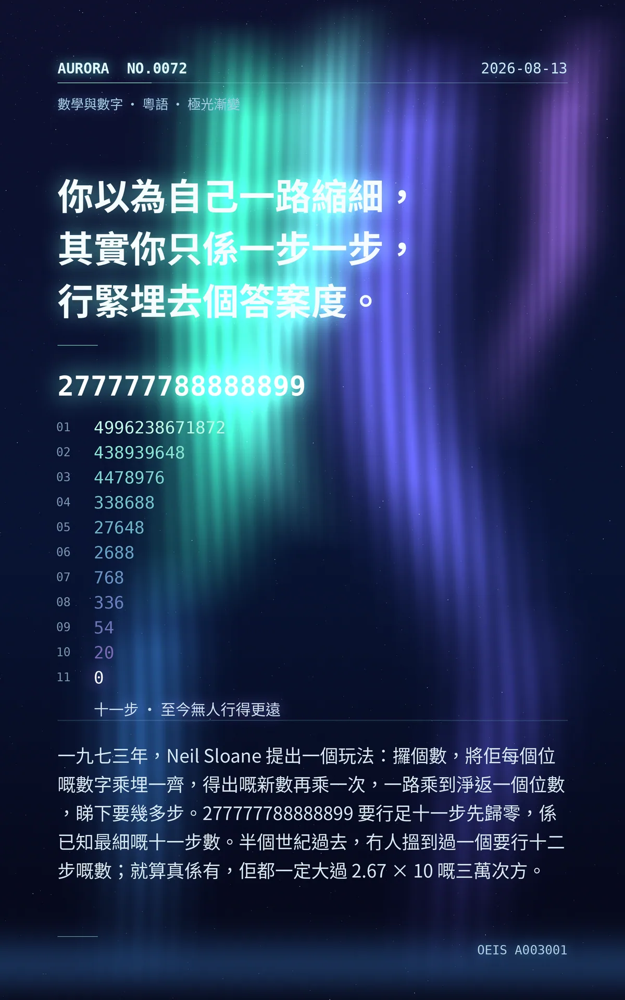

> 你以為自己一路縮細，其實你只係一步一步，行緊埋去個答案度。

**数学与数字** — 一九七三年，Neil Sloane 提出一個玩法：攞個數，將佢每個位嘅數字乘埋一齊，得出嘅新數再乘一次，一路乘到淨返一個位數，睇下要幾多步（乘法持久性）。277777788888899 要行足十一步先歸零，係已知最細嘅十一步數。半個世紀過去，冇人搵到過一個要行十二步嘅數；就算真係有，佢都一定大過 2.67 × 10 嘅三萬次方。

`2026-08-13 04:09` ｜ [原图](Cards/2026-08/NO.0072_2026-08-13_S27-极光渐变_YUE.png) ｜ [文字](text/2026-08/NO.0072_2026-08-13_S27-极光渐变_YUE.md)

---

### NO.0071 · 装饰艺术 Art Deco · 意大利文

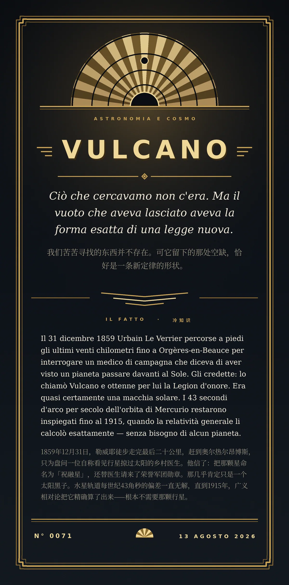

> Ciò che cercavamo non c'era. Ma il vuoto che aveva lasciato aveva la forma esatta di una legge nuova.（我们苦苦寻找的东西并不存在。可它留下的那处空缺，恰好是一条新定律的形状。）

**天文与宇宙** — Il 31 dicembre 1859 Urbain Le Verrier percorse a piedi gli ultimi venti chilometri fino a Orgères-en-Beauce per interrogare un medico di campagna che diceva di aver visto un pianeta passare davanti al Sole. Gli credette: lo chiamò Vulcano e ottenne per lui la Legion d'onore. Era quasi certamente una macchia solare. I 43 secondi d'arco per secolo dell'orbita di Mercurio restarono inspiegati fino al 1915, quando la relatività generale li calcolò esattamente — senza bisogno di alcun pianeta.（1859年12月31日，勒威耶徒步走完最后二十公里，赶到奥尔热尔昂博斯，只为盘问一位自称看见行星掠过太阳的乡村医生。他信了：把那颗星命名为「祝融星」，还替医生请来了荣誉军团勋章。那几乎肯定只是一个太阳黑子。水星轨道每世纪43角秒的偏差一直无解，直到1915年，广义相对论把它精确算了出来——根本不需要那颗行星。）

`2026-08-13 00:09` ｜ [原图](Cards/2026-08/NO.0071_2026-08-13_S15-装饰艺术_IT.png) ｜ [文字](text/2026-08/NO.0071_2026-08-13_S15-装饰艺术_IT.md)

---

### NO.0070 · 粗野主义 · 繁體中文（香港）

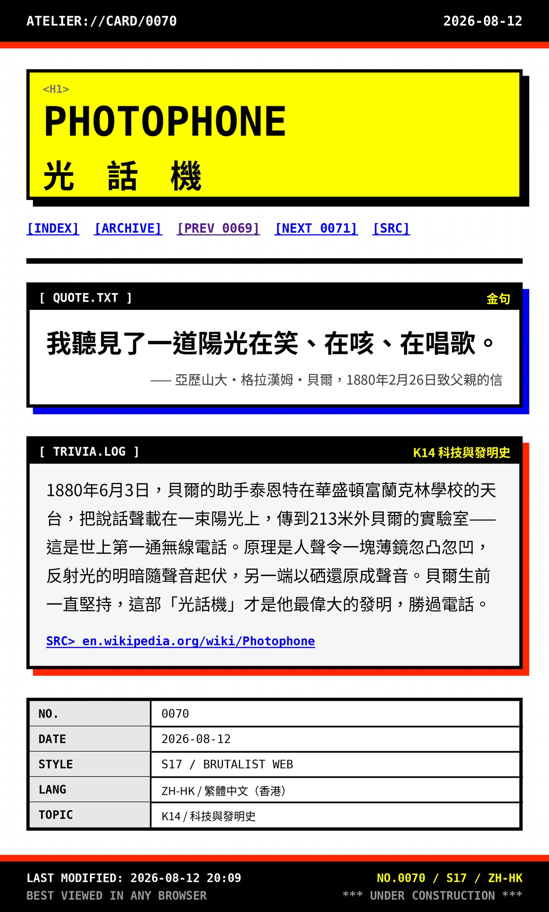

> 我聽見了一道陽光在笑、在咳、在唱歌。（亞歷山大·格拉漢姆·貝爾，1880年2月26日致父親的信）

**科技与发明史** — 1880年6月3日，貝爾的助手泰恩特在華盛頓富蘭克林學校的天台，把說話聲載在一束陽光上，傳到213米外貝爾的實驗室——這是世上第一通無線電話。原理是人聲令一塊薄鏡忽凸忽凹，反射光的明暗隨聲音起伏，另一端以硒還原成聲音。貝爾生前一直堅持，這部「光話機」才是他最偉大的發明，勝過電話。

`2026-08-12 20:09` ｜ [原图](Cards/2026-08/NO.0070_2026-08-12_S17-粗野主义_ZH-HK.png) ｜ [文字](text/2026-08/NO.0070_2026-08-12_S17-粗野主义_ZH-HK.md)

---

### NO.0069 · 青花瓷纹样 · 日文

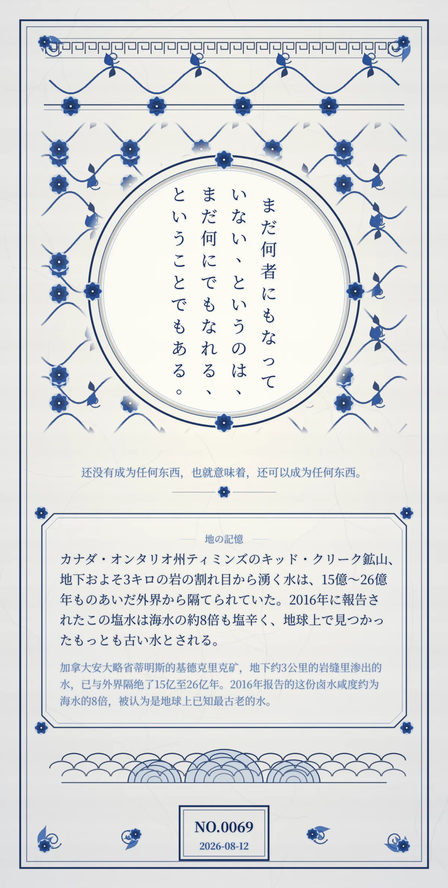

> まだ何者にもなっていない、というのは、まだ何にでもなれる、ということでもある。（还没有成为任何东西，也就意味着，还可以成为任何东西。）

**地理与地质** — カナダ・オンタリオ州ティミンズのキッド・クリーク鉱山、地下およそ3キロの岩の割れ目から湧く水は、15億〜26億年ものあいだ外界から隔てられていた。2016年に報告されたこの塩水は海水の約8倍も塩辛く、地球上で見つかったもっとも古い水とされる。（加拿大安大略省蒂明斯的基德克里克矿，地下约3公里的岩缝里渗出的水，已与外界隔绝了15亿至26亿年。2016年报告的这份卤水咸度约为海水的8倍，被认为是地球上已知最古老的水。）

`2026-08-12 16:09` ｜ [原图](Cards/2026-08/NO.0069_2026-08-12_S28-青花瓷纹样_JA.png) ｜ [文字](text/2026-08/NO.0069_2026-08-12_S28-青花瓷纹样_JA.md)

---

### NO.0068 · 老报纸头版 · 繁體中文（台灣）

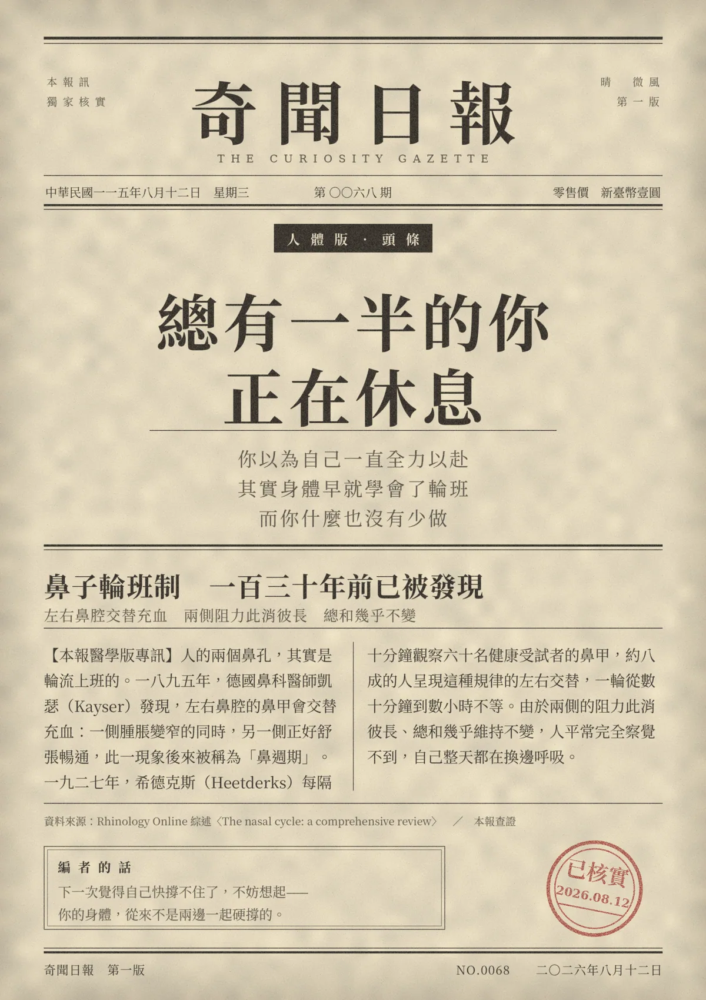

> 總有一半的你正在休息。你以為自己一直全力以赴，其實身體早就學會了輪班，而你什麼也沒有少做。

**人体与生理** — 人的兩個鼻孔其實是輪流上班的。一八九五年，德國鼻科醫師凱瑟（Kayser）發現左右鼻腔的鼻甲會交替充血：一側腫脹變窄的同時，另一側正好舒張暢通，此一現象後來被稱為「鼻週期」。一九二七年，希德克斯（Heetderks）每隔十分鐘觀察六十名健康受試者的鼻甲，約八成的人呈現這種規律的左右交替，一輪從數十分鐘到數小時不等。由於兩側的阻力此消彼長、總和幾乎維持不變，人平常完全察覺不到自己整天都在換邊呼吸。

`2026-08-12 12:09` ｜ [原图](Cards/2026-08/NO.0068_2026-08-12_S25-老報紙頭版_ZH-TW.png) ｜ [文字](text/2026-08/NO.0068_2026-08-12_S25-老報紙頭版_ZH-TW.md)

---

### NO.0067 · 拍立得照片风 · 英文

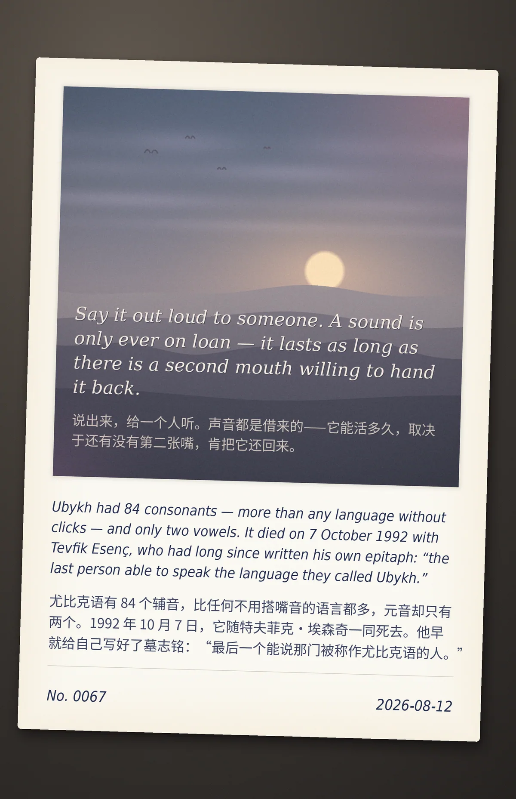

> Say it out loud to someone. A sound is only ever on loan — it lasts as long as there is a second mouth willing to hand it back.（说出来，给一个人听。声音都是借来的——它能活多久，取决于还有没有第二张嘴，肯把它还回来。）

**语言与文字** — Ubykh had 84 consonants — more than any language without clicks — and only two vowels. It died on 7 October 1992 with Tevfik Esenç, who had long since written his own epitaph: "the last person able to speak the language they called Ubykh."（尤比克语有 84 个辅音，比任何不用搭嘴音的语言都多，元音却只有两个。1992 年 10 月 7 日，它随特夫菲克·埃森奇一同死去。他早就给自己写好了墓志铭："最后一个能说那门被称作尤比克语的人。"）

`2026-08-12 08:09` ｜ [原图](Cards/2026-08/NO.0067_2026-08-12_S32-拍立得照片_EN.png) ｜ [文字](text/2026-08/NO.0067_2026-08-12_S32-拍立得照片_EN.md)

---

### NO.0066 · 包豪斯几何构成 · 简体中文

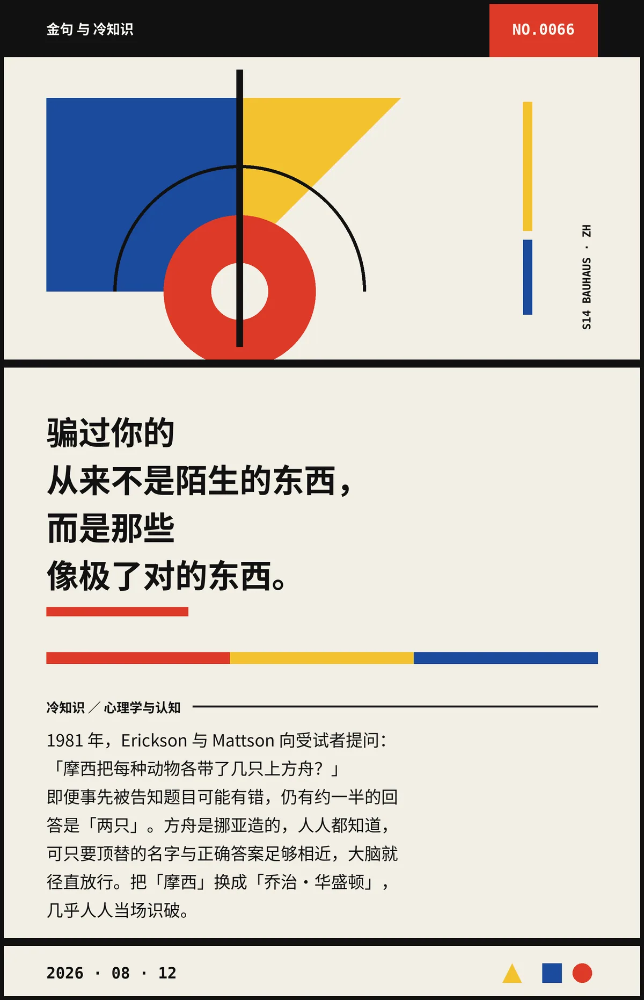

> 骗过你的从来不是陌生的东西，而是那些像极了对的东西。

**心理学与认知** — 1981 年，Erickson 与 Mattson 向受试者提问：「摩西把每种动物各带了几只上方舟？」即便事先被告知题目可能有错，仍有约一半的回答是「两只」。方舟是挪亚造的，人人都知道，可只要顶替的名字与正确答案足够相近，大脑就径直放行。把「摩西」换成「乔治·华盛顿」，几乎人人当场识破。这一现象被称为「摩西错觉」。

`2026-08-12 04:09` ｜ [原图](Cards/2026-08/NO.0066_2026-08-12_S14-包豪斯几何_ZH.png) ｜ [文字](text/2026-08/NO.0066_2026-08-12_S14-包豪斯几何_ZH.md)

---

### NO.0065 · 中国水墨写意留白 · 粵語口語

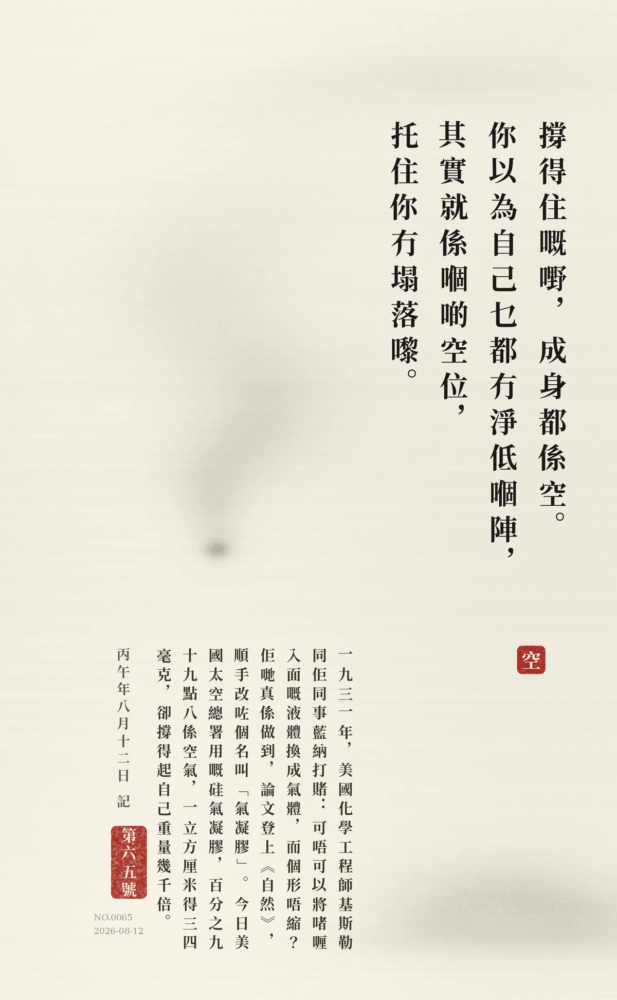

> 撐得住嘅嘢，成身都係空。你以為自己乜都冇淨低嗰陣，其實就係嗰啲空位，托住你冇塌落嚟。

**化学与材料** — 一九三一年，美國化學工程師基斯勒（Samuel Kistler）同佢同事藍納（Charles Learned）打賭：可唔可以將啫喱入面嘅液體換成氣體，而個形唔縮？佢哋真係做到，論文登上《自然》，順手改咗個名叫「氣凝膠」（aerogel）。今日美國太空總署用嘅硅氣凝膠，百分之九十九點八係空氣，一立方厘米得三四毫克，卻撐得起自己重量幾千倍。

`2026-08-12 00:09` ｜ [原图](Cards/2026-08/NO.0065_2026-08-12_S5-水墨寫意_YUE.png) ｜ [文字](text/2026-08/NO.0065_2026-08-12_S5-水墨寫意_YUE.md)

---

### NO.0064 · 3D 玻璃水晶折射 · 法文

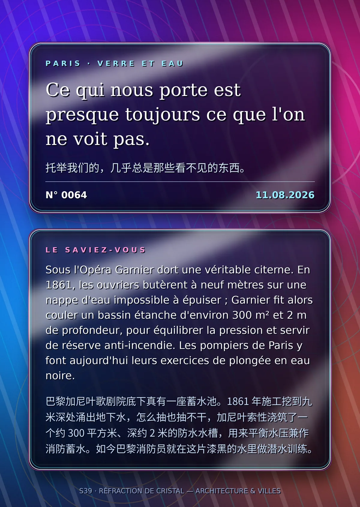

> Ce qui nous porte est presque toujours ce que l'on ne voit pas.（托举我们的，几乎总是那些看不见的东西。）

**建筑与城市** — Sous l'Opéra Garnier dort une véritable citerne. En 1861, les ouvriers butèrent à neuf mètres sur une nappe d'eau impossible à épuiser ; Garnier fit alors couler un bassin étanche d'environ 300 m² et 2 m de profondeur, pour équilibrer la pression et servir de réserve anti-incendie. Les pompiers de Paris y font aujourd'hui leurs exercices de plongée en eau noire.（巴黎加尼叶歌剧院底下真有一座蓄水池。1861 年施工挖到九米深处涌出地下水，怎么抽也抽不干，加尼叶索性浇筑了一个约 300 平方米、深约 2 米的防水水槽，用来平衡水压兼作消防蓄水。如今巴黎消防员就在这片漆黑的水里做潜水训练。）

`2026-08-11 20:09` ｜ [原图](Cards/2026-08/NO.0064_2026-08-11_S39-玻璃水晶折射_FR.png) ｜ [文字](text/2026-08/NO.0064_2026-08-11_S39-玻璃水晶折射_FR.md)

---

### NO.0063 · 新拟态柔和浮雕 · 繁體中文（香港）

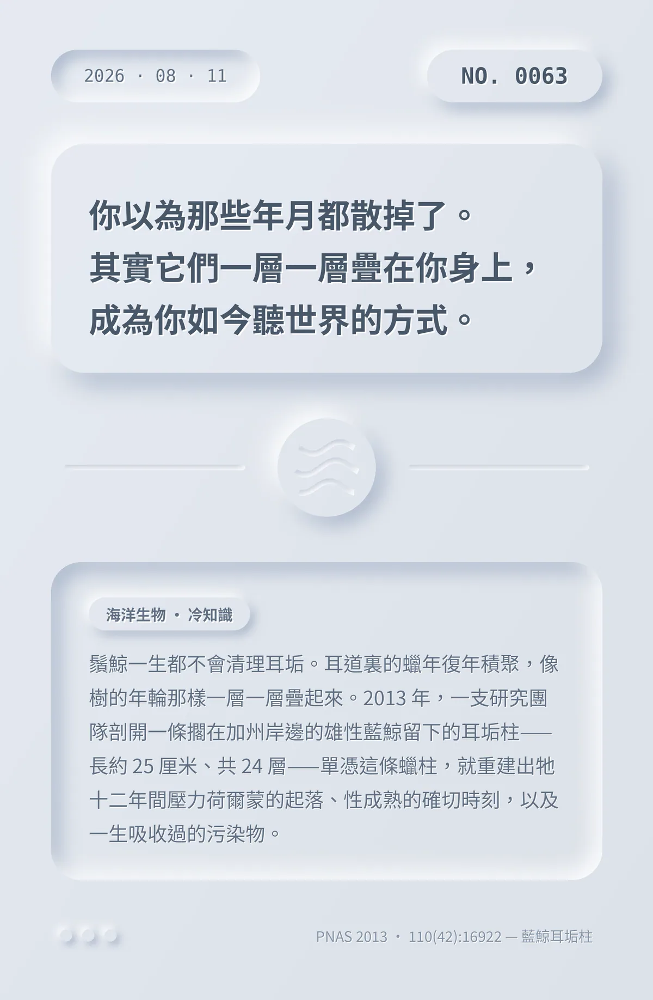

> 你以為那些年月都散掉了。其實它們一層一層疊在你身上，成為你如今聽世界的方式。

**海洋生物** — 鬚鯨一生都不會清理耳垢。耳道裏的蠟年復年積聚，像樹的年輪那樣一層一層疊起來。2013 年，一支研究團隊剖開一條擱在加州岸邊的雄性藍鯨留下的耳垢柱——長約 25 厘米、共 24 層——單憑這條蠟柱，就重建出牠十二年間壓力荷爾蒙的起落、性成熟的確切時刻，以及一生吸收過的污染物。

`2026-08-11 16:09` ｜ [原图](Cards/2026-08/NO.0063_2026-08-11_S8-新拟态浮雕_ZH-HK.png) ｜ [文字](text/2026-08/NO.0063_2026-08-11_S8-新拟态浮雕_ZH-HK.md)

---

### NO.0062 · 杂志编辑大标题排版 · 日文

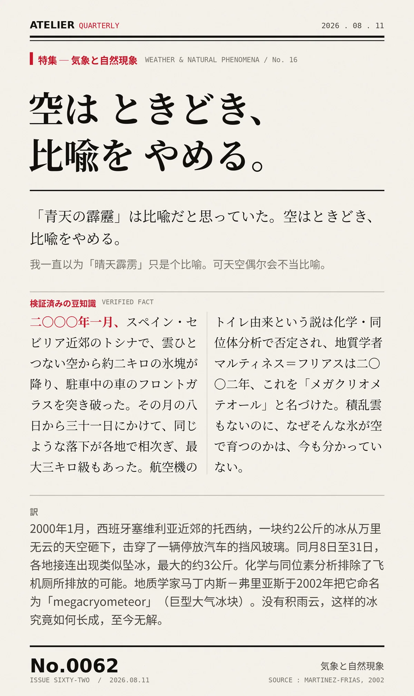

> 「青天の霹靂」は比喩だと思っていた。空はときどき、比喩をやめる。（我一直以为「晴天霹雳」只是个比喻。可天空偶尔会不当比喻。）

**気象と自然現象** — 二〇〇〇年一月、スペイン・セビリア近郊のトシナで、雲ひとつない空から約二キロの氷塊が降り、駐車中の車のフロントガラスを突き破った。その月の八日から三十一日にかけて、同じような落下が各地で相次ぎ、最大三キロ級もあった。航空機のトイレ由来という説は化学・同位体分析で否定され、地質学者マルティネス＝フリアスは二〇〇二年、これを「メガクリオメテオール」と名づけた。積乱雲もないのに、なぜそんな氷が空で育つのかは、今も分かっていない。（2000年1月，西班牙塞维利亚近郊的托西纳，一块约2公斤的冰从万里无云的天空砸下，击穿了一辆停放汽车的挡风玻璃。同月8日至31日各地接连出现类似坠冰，最大约3公斤。化学与同位素分析排除了飞机厕所排放的可能。地质学家马丁内斯－弗里亚斯于2002年将其命名为 megacryometeor。没有积雨云，这样的冰究竟如何长成，至今无解。）

`2026-08-11 12:10` ｜ [原图](Cards/2026-08/NO.0062_2026-08-11_S11-杂志编辑排版_JA.png) ｜ [文字](text/2026-08/NO.0062_2026-08-11_S11-杂志编辑排版_JA.md)

---

### NO.0061 · 復古解剖醫學插圖 · 繁體中文（台灣）

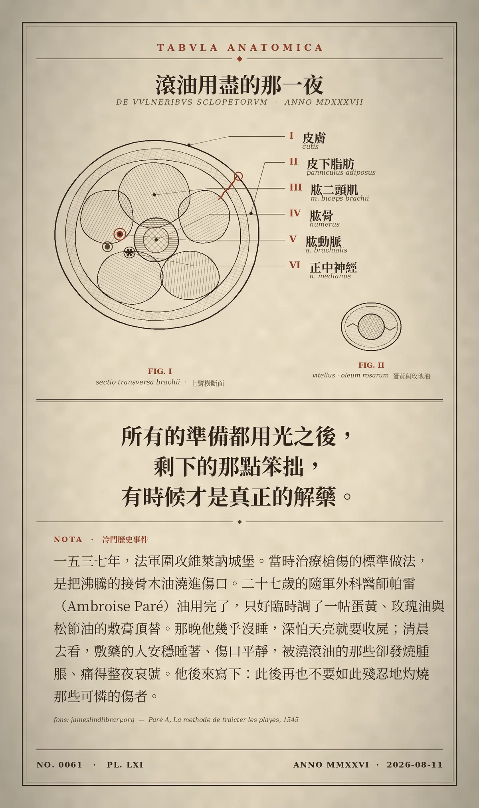

> 所有的準備都用光之後，剩下的那點笨拙，有時候才是真正的解藥。

**冷門歷史事件** — 一五三七年，法軍圍攻維萊訥城堡。當時治療槍傷的標準做法，是把沸騰的接骨木油澆進傷口。二十七歲的隨軍外科醫師帕雷（Ambroise Paré）油用完了，只好臨時調了一帖蛋黃、玫瑰油與松節油的敷膏頂替。那晚他幾乎沒睡，深怕天亮就要收屍；清晨去看，敷藥的人安穩睡著、傷口平靜，被澆滾油的那些卻發燒腫脹、痛得整夜哀號。他後來寫下：此後再也不要如此殘忍地灼燒那些可憐的傷者。

`2026-08-11 08:10` ｜ [原图](Cards/2026-08/NO.0061_2026-08-11_S34-复古解剖插图_ZH-TW.png) ｜ [文字](text/2026-08/NO.0061_2026-08-11_S34-复古解剖插图_ZH-TW.md)

---

### NO.0060 · 瑞士国际主义网格排版 · 简体中文

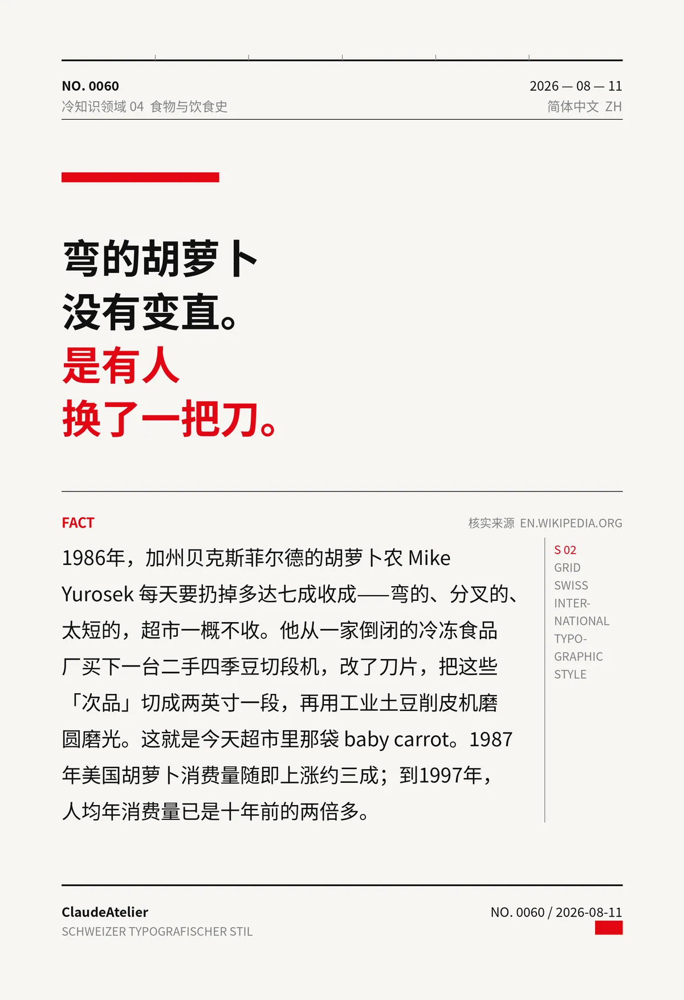

> 弯的胡萝卜没有变直。是有人换了一把刀。

**食物与饮食史** — 1986年，加州贝克斯菲尔德的胡萝卜农 Mike Yurosek 每天要扔掉多达七成收成——弯的、分叉的、太短的，超市一概不收。他从一家倒闭的冷冻食品厂买下一台二手四季豆切段机，改了刀片，把这些「次品」切成两英寸一段，再用工业土豆削皮机磨圆磨光。这就是今天超市里那袋 baby carrot。1987年美国胡萝卜消费量随即上涨约三成；到1997年，人均年消费量已是十年前的两倍多。

`2026-08-11 00:10` ｜ [原图](Cards/2026-08/NO.0060_2026-08-11_S2-瑞士国际主义_ZH.png) ｜ [文字](text/2026-08/NO.0060_2026-08-11_S2-瑞士国际主义_ZH.md)

---

### NO.0059 · 植物學圖鑑插畫 · 粵語口語

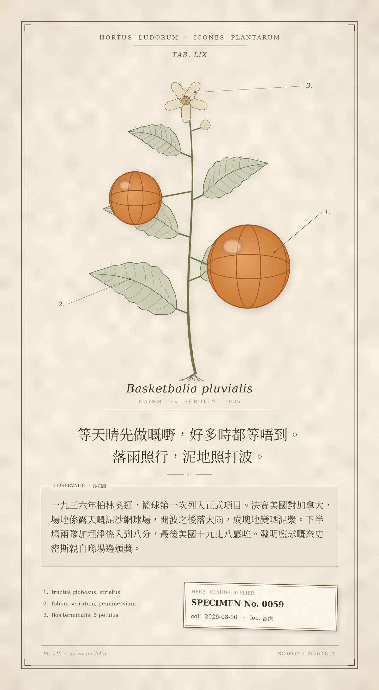

> 等天晴先做嘅嘢，好多時都等唔到。落雨照行，泥地照打波。

**體育與遊戲** — 一九三六年柏林奧運，籃球第一次列入正式項目。決賽美國對加拿大，場地係露天嘅泥沙網球場，開波之後落大雨，成塊地變晒泥漿。下半場兩隊加埋淨係入到八分，最後美國十九比八贏咗。發明籃球嘅奈史密斯親自喺場邊頒獎。

`2026-08-10 20:10` ｜ [原图](Cards/2026-08/NO.0059_2026-08-10_S20-植物圖鑑_YUE.png) ｜ [文字](text/2026-08/NO.0059_2026-08-10_S20-植物圖鑑_YUE.md)

---

### NO.0058 · 復古牛皮紙做舊 · 繁體中文（台灣）

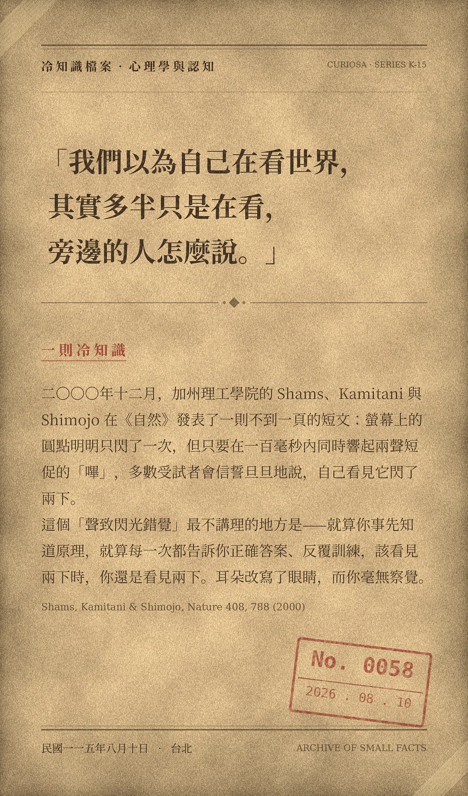

> 我們以為自己在看世界，其實多半只是在看，旁邊的人怎麼說。

**心理學與認知** — 二〇〇〇年十二月，加州理工學院的 Shams、Kamitani 與 Shimojo 在《自然》發表了一則不到一頁的短文：螢幕上的圓點明明只閃了一次，但只要在一百毫秒內同時響起兩聲短促的「嗶」，多數受試者會信誓旦旦地說，自己看見它閃了兩下。這個「聲致閃光錯覺」最不講理的地方是——就算你事先知道原理，就算每一次都告訴你正確答案、反覆訓練，該看見兩下時，你還是看見兩下。耳朵改寫了眼睛，而你毫無察覺。

`2026-08-10 18:08` ｜ [原图](Cards/2026-08/NO.0058_2026-08-10_S9-復古牛皮紙_ZH-TW.png) ｜ [文字](text/2026-08/NO.0058_2026-08-10_S9-復古牛皮紙_ZH-TW.md)

---

### NO.0057 · 3D 体积光与景深 · 日文

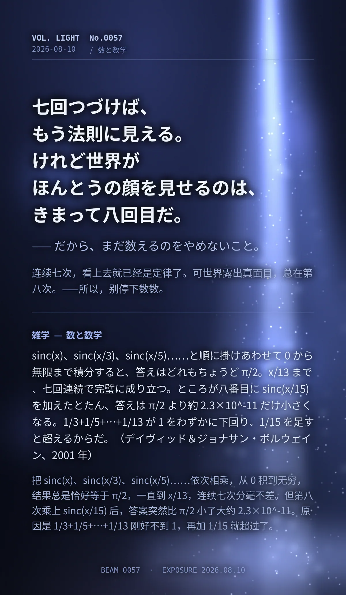

> 七回つづけば、もう法則に見える。けれど世界がほんとうの顔を見せるのは、きまって八回目だ。—— だから、まだ数えるのをやめないこと。（连续七次，看上去就已经是定律了。可世界露出真面目，总在第八次。——所以，别停下数数。）

**数学与数字** — sinc(x)、sinc(x/3)、sinc(x/5)……と順に掛けあわせて 0 から無限まで積分すると、答えはどれもちょうど π/2。x/13 まで七回連続で完璧に成り立つが、八番目に sinc(x/15) を加えたとたん、答えは π/2 より約 2.3×10^-11 だけ小さくなる。1/3+1/5+…+1/13 が 1 をわずかに下回り、1/15 を足すと超えるためで、ボルウェイン親子が 2001 年に発表した。（把 sinc(x)、sinc(x/3)、sinc(x/5)……依次相乘从 0 积到无穷，结果总是恰好 π/2，一直到 x/13 连续七次分毫不差；第八次乘上 sinc(x/15) 后突然比 π/2 小了约 2.3×10^-11。）

`2026-08-10 08:10` ｜ [原图](Cards/2026-08/NO.0057_2026-08-10_S47-体积光景深_JA.png) ｜ [文字](text/2026-08/NO.0057_2026-08-10_S47-体积光景深_JA.md)

---

### NO.0056 · 3D 立體擠出文字 · 繁體中文（台灣）

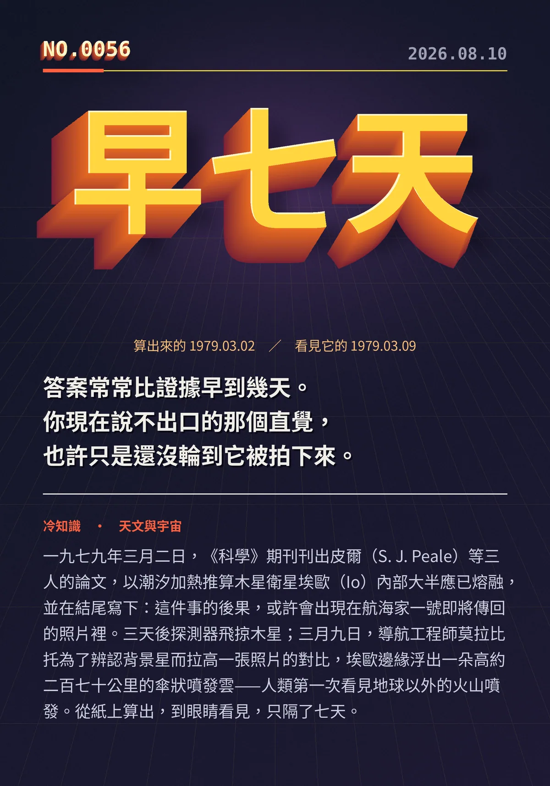

> 答案常常比證據早到幾天。你現在說不出口的那個直覺，也許只是還沒輪到它被拍下來。

**天文與宇宙** — 一九七九年三月二日，《科學》期刊刊出皮爾（S. J. Peale）等三人的論文，以潮汐加熱推算木星衛星埃歐（Io）內部大半應已熔融，並在結尾寫下：這件事的後果，或許會出現在航海家一號即將傳回的照片裡。三天後探測器飛掠木星；三月九日，導航工程師莫拉比托為了辨認背景星而拉高一張照片的對比，埃歐邊緣浮出一朵高約二百七十公里的傘狀噴發雲——人類第一次看見地球以外的火山噴發。從紙上算出，到眼睛看見，只隔了七天。

`2026-08-10 04:10` ｜ [原图](Cards/2026-08/NO.0056_2026-08-10_S40-立體擠出字_ZH-TW.png) ｜ [文字](text/2026-08/NO.0056_2026-08-10_S40-立體擠出字_ZH-TW.md)

---

### NO.0055 · 星图天文星座 · 英文

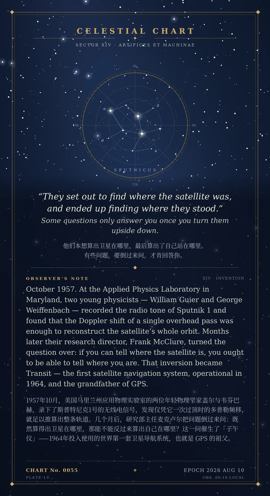

> “They set out to find where the satellite was, and ended up finding where they stood.” Some questions only answer you once you turn them upside down.（他们本想算出卫星在哪里，最后算出了自己站在哪里。有些问题，要倒过来问，才肯回答你。）

**科技与发明史** — 1957年10月，美国马里兰州约翰斯·霍普金斯大学应用物理实验室的两位年轻物理学家 William Guier 与 George Weiffenbach，录下了斯普特尼克1号的无线电信号，发现仅凭它一次过顶时的多普勒频移，就足以推算出整条轨道。几个月后，研究部主任 Frank McClure 把问题倒过来问：既然算得出卫星在哪里，那能不能反过来算出自己在哪里？这一问催生了「子午仪」（Transit）——1964年投入使用的世界第一套卫星导航系统，也就是 GPS 的祖父。

`2026-08-10 00:10` ｜ [原图](Cards/2026-08/NO.0055_2026-08-10_S21-星图星座_EN.png) ｜ [文字](text/2026-08/NO.0055_2026-08-10_S21-星图星座_EN.md)

---

### NO.0054 · 黑胶唱片封套 · 简体中文

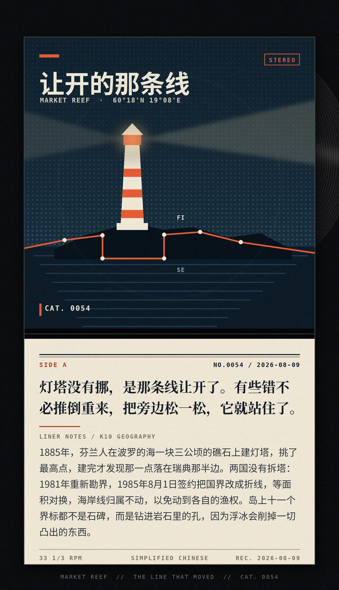

> 灯塔没有挪，是那条线让开了。有些错不必推倒重来，把旁边松一松，它就站住了。

**地理与地质** — 1885年，芬兰人在波罗的海一块三公顷的礁石上建灯塔，挑了最高点，建完才发现那一点落在瑞典那半边。两国没有拆塔：1981年重新勘界，1985年8月1日签约把国界改成折线，等面积对换，海岸线归属不动，以免动到各自的渔权。岛上十一个界标都不是石碑，而是钻进岩石里的孔，因为浮冰会削掉一切凸出的东西。

`2026-08-09 20:09` ｜ [原图](Cards/2026-08/NO.0054_2026-08-09_S35-黑胶封套_ZH.png) ｜ [文字](text/2026-08/NO.0054_2026-08-09_S35-黑胶封套_ZH.md)

---

### NO.0053 · 剪紙拼貼 · 粵語口語

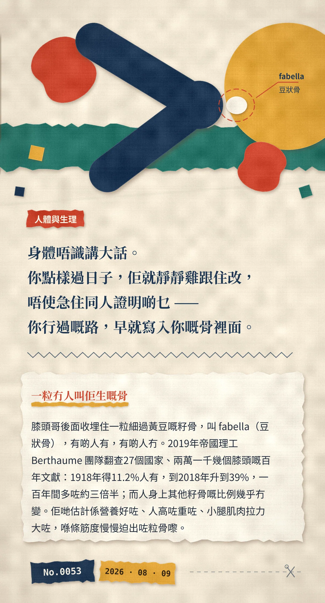

> 身體唔識講大話。你點樣過日子，佢就靜靜雞跟住改，唔使急住同人證明啲乜——你行過嘅路，早就寫入你嘅骨裡面。

**人体与生理** — 膝頭哥後面收埋住一粒細過黃豆嘅籽骨，叫 fabella（豆狀骨），有啲人有，有啲人冇。2019年帝國理工 Berthaume 團隊翻查27個國家、兩萬一千幾個膝頭嘅百年文獻：1918年得11.2%人有，到2018年升到39%，一百年間多咗約三倍半；而人身上其他籽骨嘅比例幾乎冇變。佢哋估計係營養好咗、人高咗重咗、小腿肌肉拉力大咗，喺條筋度慢慢迫出咗粒骨嚟。

`2026-08-09 16:10` ｜ [原图](Cards/2026-08/NO.0053_2026-08-09_S33-剪紙拼貼_YUE.png) ｜ [文字](text/2026-08/NO.0053_2026-08-09_S33-剪紙拼貼_YUE.md)

---

### NO.0052 · 装饰艺术 Art Deco · 德文

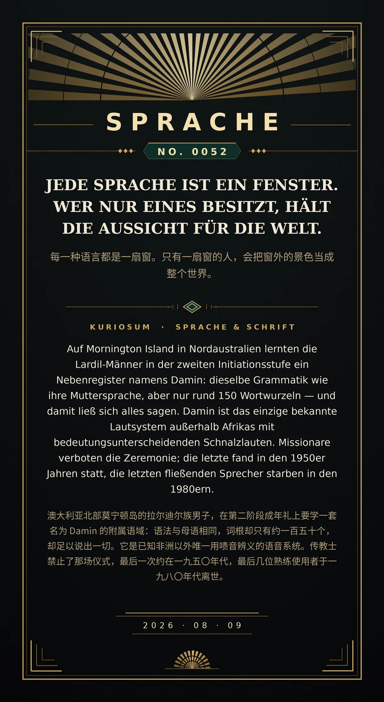

> Jede Sprache ist ein Fenster. Wer nur eines besitzt, hält die Aussicht für die Welt.（每一种语言都是一扇窗。只有一扇窗的人，会把窗外的景色当成整个世界。）

**语言与文字** — Auf Mornington Island in Nordaustralien lernten die Lardil-Männer in der zweiten Initiationsstufe ein Nebenregister namens Damin: dieselbe Grammatik wie ihre Muttersprache, aber nur rund 150 Wortwurzeln — und damit ließ sich alles sagen. Damin ist das einzige bekannte Lautsystem außerhalb Afrikas mit bedeutungsunterscheidenden Schnalzlauten. Missionare verboten die Zeremonie; die letzte fand in den 1950er Jahren statt, die letzten fließenden Sprecher starben in den 1980ern.（澳大利亚北部莫宁顿岛的拉尔迪尔族男子，在第二阶段成年礼上要学一套名为 Damin 的附属语域：语法与母语相同，词根却只有约一百五十个，却足以说出一切。它是已知非洲以外唯一用啧音辨义的语音系统。传教士禁止了那场仪式，最后一次约在一九五〇年代，最后几位熟练使用者于一九八〇年代离世。）

`2026-08-09 12:09` ｜ [原图](Cards/2026-08/NO.0052_2026-08-09_S15-装饰艺术_DE.png) ｜ [文字](text/2026-08/NO.0052_2026-08-09_S15-装饰艺术_DE.md)

---

### NO.0051 · 3D 堆叠透视卡片 · 繁體中文（香港）

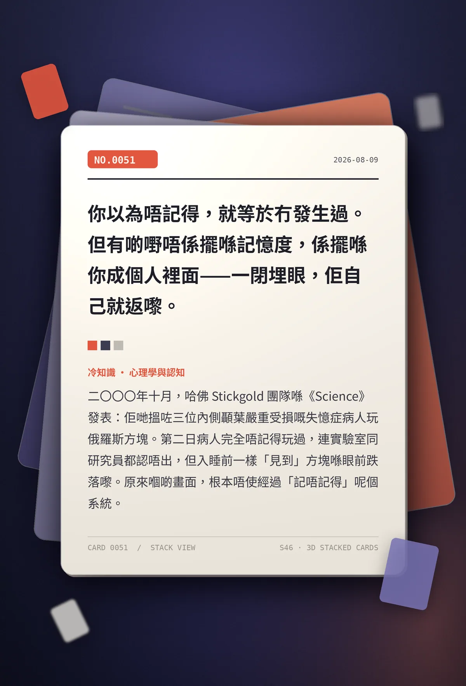

> 你以為唔記得，就等於冇發生過。但有啲嘢唔係擺喺記憶度，係擺喺你成個人裡面——一閉埋眼，佢自己就返嚟。

**心理學與認知** — 二〇〇〇年十月，哈佛 Stickgold 團隊喺《Science》發表：佢哋搵咗三位內側顳葉嚴重受損嘅失憶症病人玩俄羅斯方塊。第二日病人完全唔記得玩過，連實驗室同研究員都認唔出，但入睡前一樣「見到」方塊喺眼前跌落嚟。原來嗰啲畫面，根本唔使經過「記唔記得」呢個系統。

`2026-08-09 08:09` ｜ [原图](Cards/2026-08/NO.0051_2026-08-09_S46-3D堆疊卡片_ZH-HK.png) ｜ [文字](text/2026-08/NO.0051_2026-08-09_S46-3D堆疊卡片_ZH-HK.md)

---

### NO.0050 · 日式侘寂素雅 · 繁體中文（台灣）

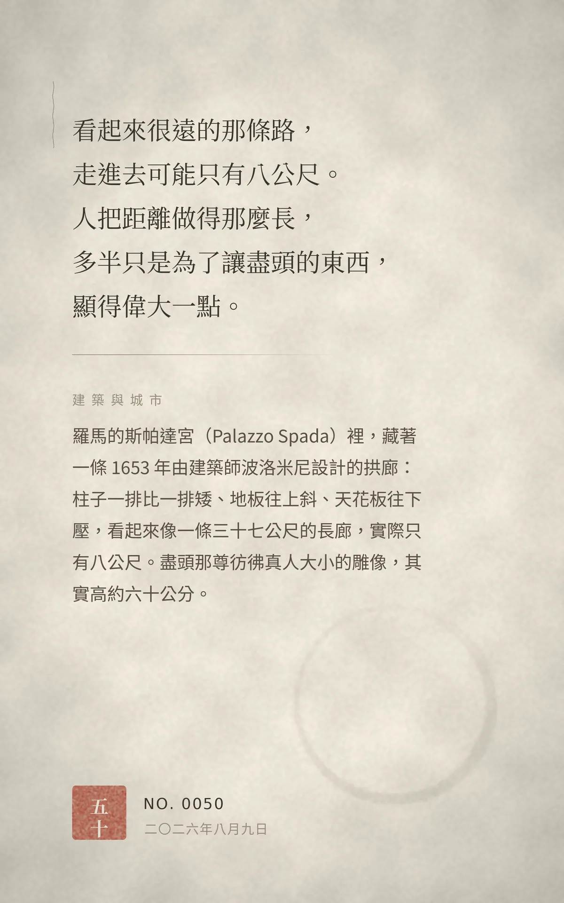

> 看起來很遠的那條路，走進去可能只有八公尺。人把距離做得那麼長，多半只是為了讓盡頭的東西，顯得偉大一點。

**建築與城市** — 羅馬的斯帕達宮（Palazzo Spada）裡，藏著一條 1653 年由建築師波洛米尼設計的拱廊：柱子一排比一排矮、地板往上斜、天花板往下壓，看起來像一條三十七公尺的長廊，實際只有八公尺。盡頭那尊彷彿真人大小的雕像，其實高約六十公分。

`2026-08-09 00:09` ｜ [原图](Cards/2026-08/NO.0050_2026-08-09_S6-日式侘寂_ZH-TW.png) ｜ [文字](text/2026-08/NO.0050_2026-08-09_S6-日式侘寂_ZH-TW.md)

---

### NO.0049 · 3D 多层纸雕浮雕 · 英文

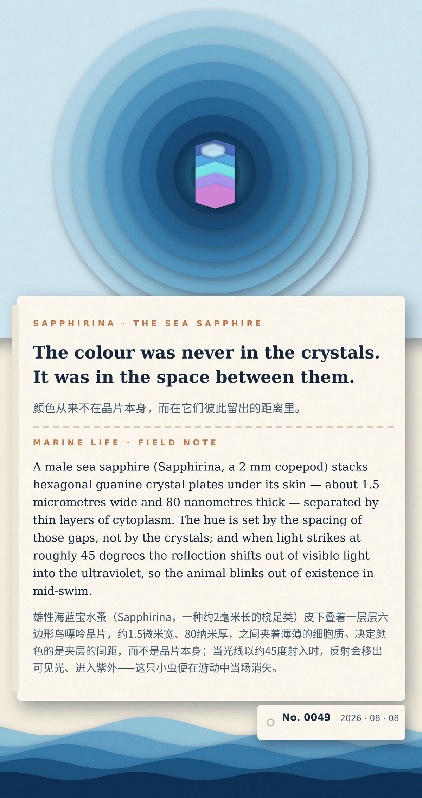

> The colour was never in the crystals. It was in the space between them.（颜色从来不在晶片本身，而在它们彼此留出的距离里。）

**海洋生物** — A male sea sapphire (Sapphirina, a 2 mm copepod) stacks hexagonal guanine crystal plates under its skin — about 1.5 micrometres wide and 80 nanometres thick — separated by thin layers of cytoplasm. The hue is set by the spacing of those gaps, not by the crystals; and when light strikes at roughly 45 degrees the reflection shifts out of visible light into the ultraviolet, so the animal blinks out of existence in mid-swim.（雄性海蓝宝水蚤皮下叠着一层层六边形鸟嘌呤晶片，约1.5微米宽、80纳米厚，之间夹着细胞质。决定颜色的是夹层间距而非晶片本身；当光以约45度射入，反射移出可见光进入紫外，这只小虫便在游动中当场消失。）

`2026-08-08 20:09` ｜ [原图](Cards/2026-08/NO.0049_2026-08-08_S42-多层纸雕浮雕_EN.png) ｜ [文字](text/2026-08/NO.0049_2026-08-08_S42-多层纸雕浮雕_EN.md)

---

### NO.0048 · 航空信封邮票 · 简体中文

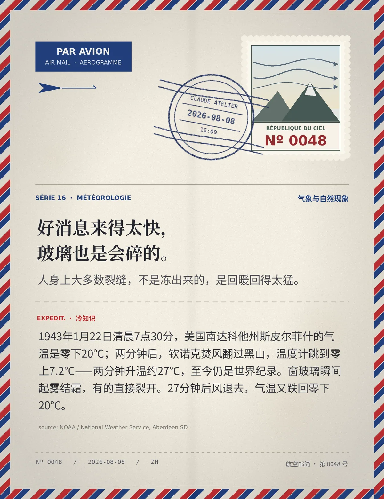

> 好消息来得太快，玻璃也是会碎的。人身上大多数裂缝，不是冻出来的，是回暖回得太猛。

**气象与自然现象** — 1943年1月22日清晨7点30分，美国南达科他州斯皮尔菲什的气温是零下20℃；两分钟后，钦诺克焚风翻过黑山，温度计跳到零上7.2℃——两分钟升温约27℃，至今仍是世界纪录。窗玻璃瞬间起雾结霜，有的直接裂开。27分钟后风退去，气温又跌回零下20℃。

`2026-08-08 16:09` ｜ [原图](Cards/2026-08/NO.0048_2026-08-08_S23-航空信封邮票_ZH.png) ｜ [文字](text/2026-08/NO.0048_2026-08-08_S23-航空信封邮票_ZH.md)

---

### NO.0047 · 舊車票·電影票根 · 粵語口語

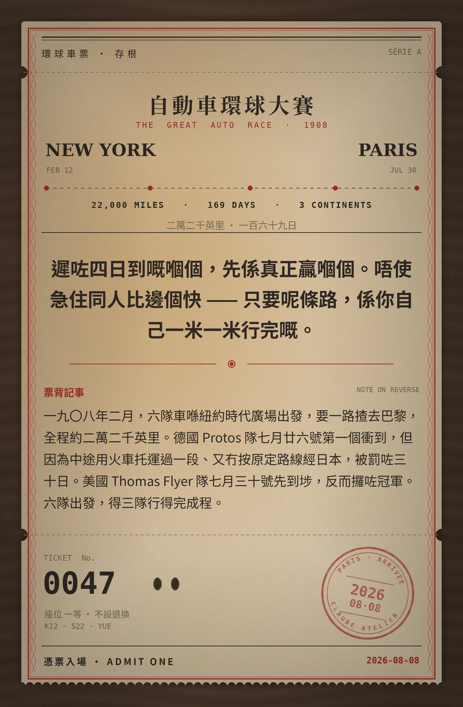

> 遲咗四日到嘅嗰個，先係真正贏嗰個。唔使急住同人比邊個快 —— 只要呢條路，係你自己一米一米行完嘅。

**冷門歷史事件** — 一九〇八年二月，六隊車喺紐約時代廣場出發，要一路揸去巴黎，全程約二萬二千英里。德國 Protos 隊七月廿六號第一個衝到，但因為中途用火車托運過一段、又冇按原定路線經日本，被罰咗三十日。美國 Thomas Flyer 隊七月三十號先到埗，反而攞咗冠軍。六隊出發，得三隊行得完成程。

`2026-08-08 12:09` ｜ [原图](Cards/2026-08/NO.0047_2026-08-08_S22-舊車票票根_YUE.png) ｜ [文字](text/2026-08/NO.0047_2026-08-08_S22-舊車票票根_YUE.md)

---

### NO.0046 · 3D 玻璃水晶折射 · 韩文

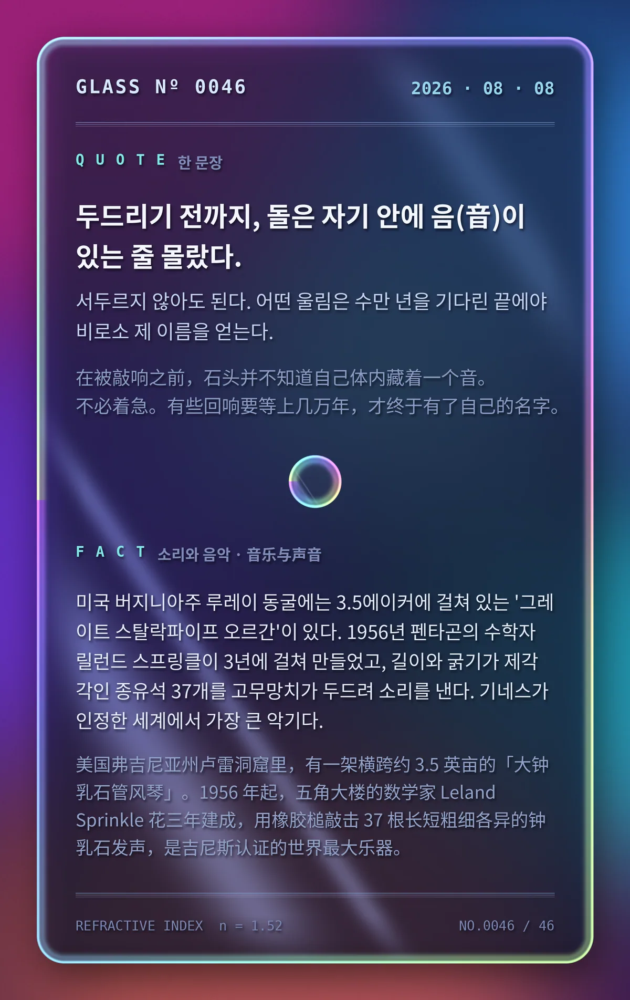

> 두드리기 전까지, 돌은 자기 안에 음(音)이 있는 줄 몰랐다. 서두르지 않아도 된다. 어떤 울림은 수만 년을 기다린 끝에야 비로소 제 이름을 얻는다.（在被敲响之前，石头并不知道自己体内藏着一个音。不必着急。有些回响要等上几万年，才终于有了自己的名字。）

**音乐与声音** — 美国弗吉尼亚州卢雷洞窟里，有一架横跨约 3.5 英亩的「大钟乳石管风琴」（Great Stalacpipe Organ）。1956 年起，五角大楼的数学家 Leland Sprinkle 花三年建成，用橡胶槌敲击 37 根长短粗细各异的钟乳石发声，是吉尼斯认证的世界最大乐器。

`2026-08-08 08:09` ｜ [原图](Cards/2026-08/NO.0046_2026-08-08_S39-3D玻璃折射_KO.png) ｜ [文字](text/2026-08/NO.0046_2026-08-08_S39-3D玻璃折射_KO.md)

---

### NO.0045 · 港式霓虹招牌 · 繁體中文（香港）

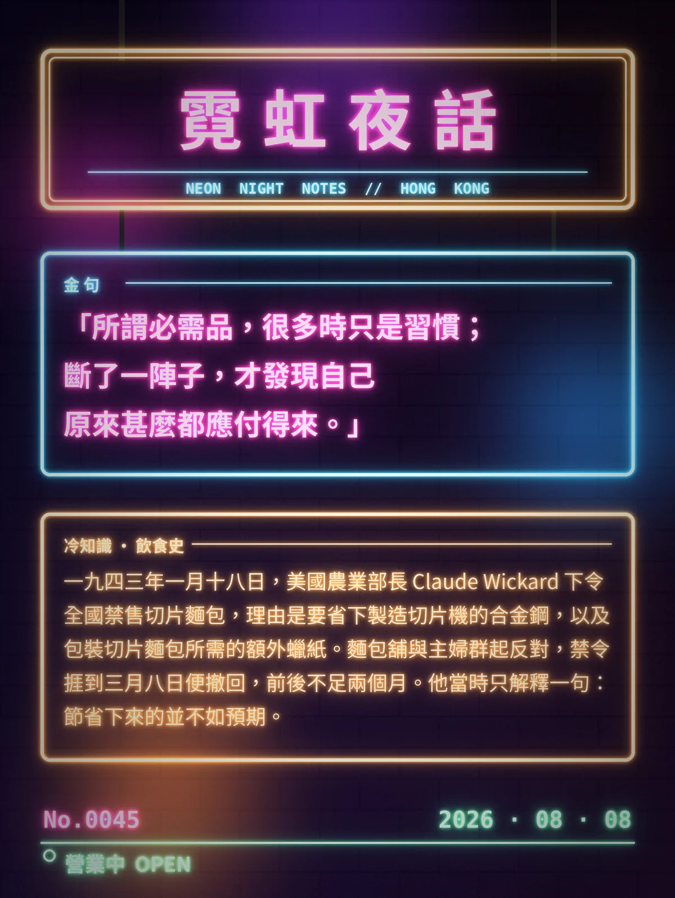

> 「所謂必需品，很多時只是習慣；斷了一陣子，才發現自己原來甚麼都應付得來。」

**食物與飲食史** — 一九四三年一月十八日，美國農業部長 Claude Wickard 下令全國禁售切片麵包，理由是要省下製造切片機的合金鋼，以及包裝切片麵包所需的額外蠟紙。麵包舖與主婦群起反對，禁令捱到三月八日便撤回，前後不足兩個月。他當時只解釋一句：節省下來的並不如預期。

`2026-08-08 04:09` ｜ [原图](Cards/2026-08/NO.0045_2026-08-08_S31-港式霓虹招牌_ZH-HK.png) ｜ [文字](text/2026-08/NO.0045_2026-08-08_S31-港式霓虹招牌_ZH-HK.md)

---

### NO.0044 · 禪意枯山水 · 日文

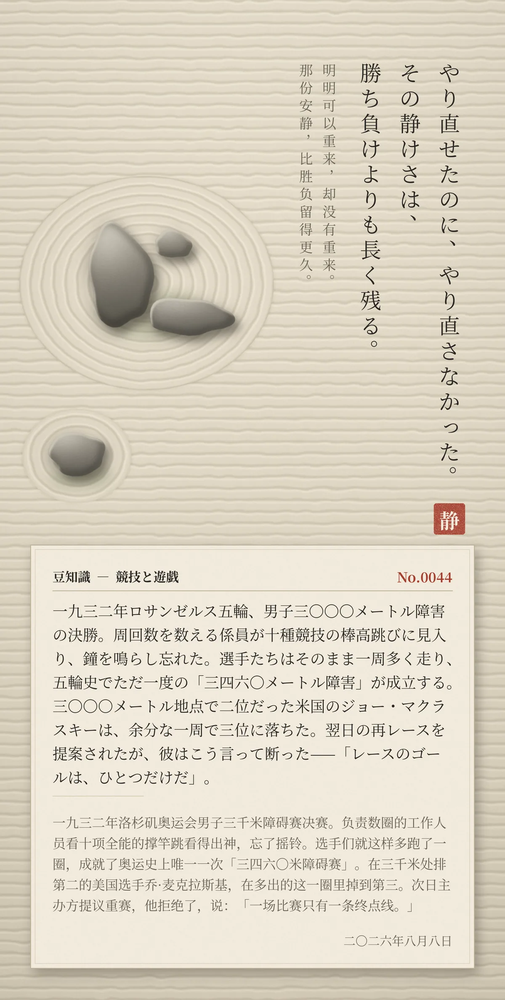

> やり直せたのに、やり直さなかった。その静けさは、勝ち負けよりも長く残る。（明明可以重来，却没有重来。那份安静，比胜负留得更久。）

**体育与游戏** — 一九三二年ロサンゼルス五輪、男子三〇〇〇メートル障害の決勝。周回数を数える係員が十種競技の棒高跳びに見入り、鐘を鳴らし忘れた。選手たちはそのまま一周多く走り、五輪史でただ一度の「三四六〇メートル障害」が成立する。三〇〇〇メートル地点で二位だった米国のジョー・マクラスキーは、余分な一周で三位に落ちた。翌日の再レースを提案されたが、彼はこう言って断った——「レースのゴールは、ひとつだけだ」。（1932年洛杉矶奥运会男子3000米障碍赛决赛，数圈的工作人员看十项全能撑竿跳看得出神忘了摇铃，全体选手多跑了一圈，成为奥运史上唯一一次「3460米障碍赛」；3000米处排第二的美国选手乔·麦克拉斯基因此掉到第三，次日主办方提议重赛，他拒绝了。）

`2026-08-08 00:09` ｜ [原图](Cards/2026-08/NO.0044_2026-08-08_S36-禅意枯山水_JA.png) ｜ [文字](text/2026-08/NO.0044_2026-08-08_S36-禅意枯山水_JA.md)

---

### NO.0043 · 工程藍圖 · 繁體中文（台灣）

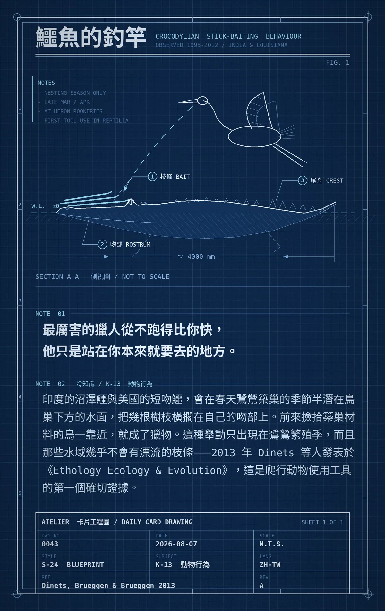

> 最厲害的獵人從不跑得比你快，他只是站在你本來就要去的地方。

**動物行為** — 印度的沼澤鱷與美國的短吻鱷，會在春天鷺鷥築巢的季節半潛在鳥巢下方的水面，把幾根樹枝橫擱在自己的吻部上。前來撿拾築巢材料的鳥一靠近，就成了獵物。這種舉動只出現在鷺鷥繁殖季，而且那些水域幾乎不會有漂流的枝條——2013 年 Dinets 等人發表於《Ethology Ecology & Evolution》，這是爬行動物使用工具的第一個確切證據。

`2026-08-07 20:09` ｜ [原图](Cards/2026-08/NO.0043_2026-08-07_S24-工程藍圖_ZH-TW.png) ｜ [文字](text/2026-08/NO.0043_2026-08-07_S24-工程藍圖_ZH-TW.md)

---

### NO.0042 · 复古解剖医学插图 · 英文

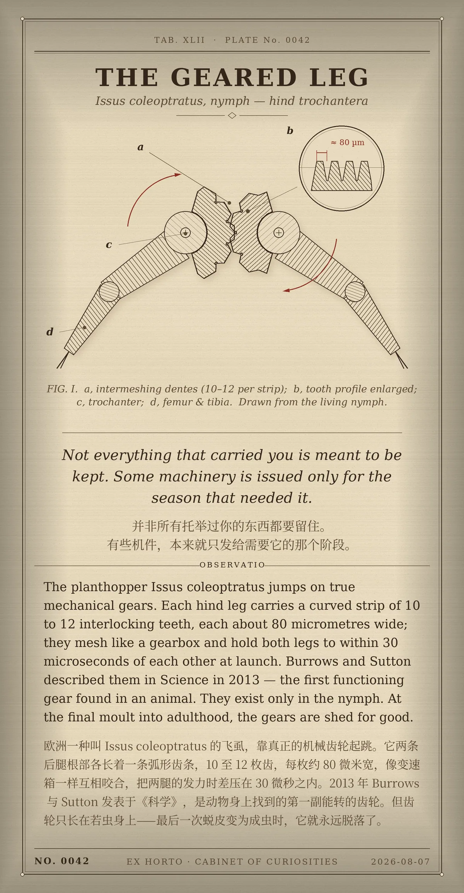

> Not everything that carried you is meant to be kept. Some machinery is issued only for the season that needed it. / 并非所有托举过你的东西都要留住。有些机件，本来就只发给需要它的那个阶段。

**昆虫与植物** — The planthopper Issus coleoptratus jumps on true mechanical gears. Each hind leg carries a curved strip of 10 to 12 interlocking teeth, each about 80 micrometres wide; they mesh like a gearbox and hold both legs to within 30 microseconds of each other at launch. Burrows and Sutton described them in Science in 2013 — the first functioning gear found in an animal. They exist only in the nymph. At the final moult into adulthood, the gears are shed for good. / 欧洲一种叫 Issus coleoptratus 的飞虱，靠真正的机械齿轮起跳。它两条后腿根部各长着一条弧形齿条，10 至 12 枚齿，每枚约 80 微米宽，像变速箱一样互相咬合，把两腿的发力时差压在 30 微秒之内。2013 年 Burrows 与 Sutton 发表于《科学》，是动物身上找到的第一副能转的齿轮。但齿轮只长在若虫身上——最后一次蜕皮变为成虫时，它就永远脱落了。

`2026-08-07 16:16` ｜ [原图](Cards/2026-08/NO.0042_2026-08-07_S34-复古解剖插图_EN.png) ｜ [文字](text/2026-08/NO.0042_2026-08-07_S34-复古解剖插图_EN.md)

---

### NO.0041 · 玻璃拟态毛玻璃 · 简体中文

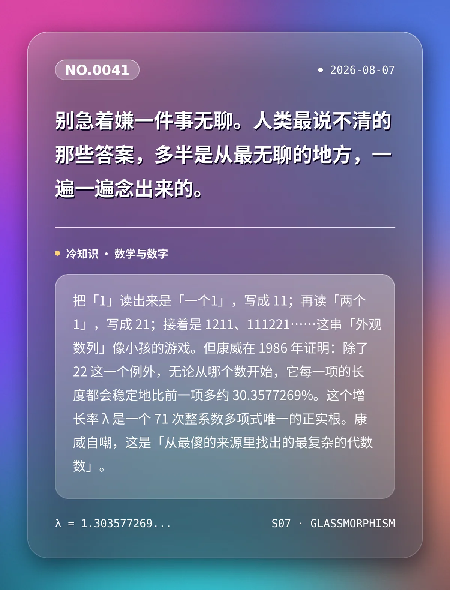

> 别急着嫌一件事无聊。人类最说不清的那些答案，多半是从最无聊的地方，一遍一遍念出来的。

**数学与数字** — 把「1」读出来是「一个1」，写成 11；再读「两个1」，写成 21；接着是 1211、111221……这串「外观数列」像小孩的游戏。但康威在 1986 年证明：除了 22 这一个例外，无论从哪个数开始，它每一项的长度都会稳定地比前一项多约 30.3577269%。这个增长率 λ 是一个 71 次整系数多项式唯一的正实根。康威自嘲，这是「从最傻的来源里找出的最复杂的代数数」。

`2026-08-07 12:09` ｜ [原图](Cards/2026-08/NO.0041_2026-08-07_S7-玻璃拟态_ZH.png) ｜ [文字](text/2026-08/NO.0041_2026-08-07_S7-玻璃拟态_ZH.md)

---

### NO.0040 · 新擬態柔和浮雕 · 粵語口語

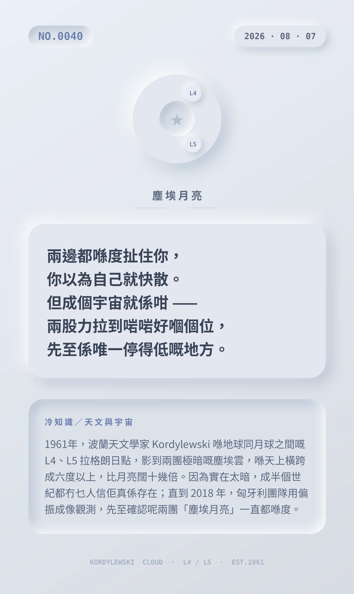

> 兩邊都喺度扯住你，你以為自己就快散。但成個宇宙就係咁——兩股力拉到啱啱好嗰個位，先至係唯一停得低嘅地方。

**天文與宇宙** — 1961年，波蘭天文學家 Kordylewski 喺地球同月球之間嘅 L4、L5 拉格朗日點，影到兩團極暗嘅塵埃雲，喺天上橫跨成六度以上，比月亮闊十幾倍。因為實在太暗，成半個世紀都冇乜人信佢真係存在；直到 2018 年，匈牙利團隊用偏振成像觀測，先至確認呢兩團「塵埃月亮」一直都喺度。

`2026-08-07 08:09` ｜ [原图](Cards/2026-08/NO.0040_2026-08-07_S8-新擬態浮雕_YUE.png) ｜ [文字](text/2026-08/NO.0040_2026-08-07_S8-新擬態浮雕_YUE.md)

---

### NO.0039 · 极光渐变梦幻 · 西班牙文

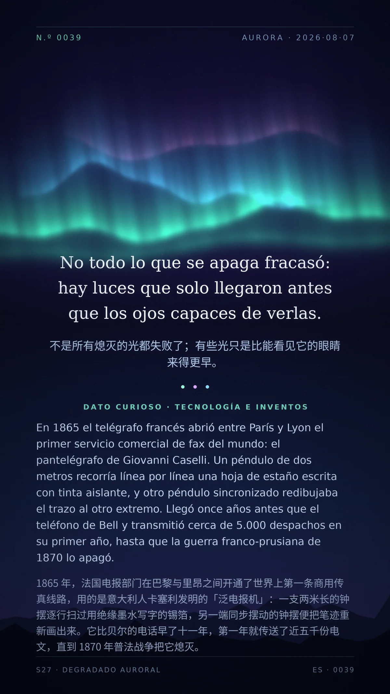

> No todo lo que se apaga fracasó: hay luces que solo llegaron antes que los ojos capaces de verlas. / 不是所有熄灭的光都失败了；有些光只是比能看见它的眼睛来得更早。

**科技与发明史** — En 1865 el telégrafo francés abrió entre París y Lyon el primer servicio comercial de fax del mundo: el pantelégrafo de Giovanni Caselli. Un péndulo de dos metros recorría línea por línea una hoja de estaño escrita con tinta aislante, y otro péndulo sincronizado redibujaba el trazo al otro extremo. Llegó once años antes que el teléfono de Bell y transmitió cerca de 5.000 despachos en su primer año, hasta que la guerra franco-prusiana de 1870 lo apagó. / 1865 年，法国电报部门在巴黎与里昂之间开通了世界上第一条商用传真线路，用的是意大利人卡塞利发明的「泛电报机」：一支两米长的钟摆逐行扫过用绝缘墨水写字的锡箔，另一端同步摆动的钟摆便把笔迹重新画出来。它比贝尔的电话早了十一年，第一年就传送了近五千份电文，直到 1870 年普法战争把它熄灭。

`2026-08-07 04:09` ｜ [原图](Cards/2026-08/NO.0039_2026-08-07_S27-极光渐变梦幻_ES.png) ｜ [文字](text/2026-08/NO.0039_2026-08-07_S27-极光渐变梦幻_ES.md)

---

### NO.0038 · 雜誌編輯大標題排版 · 繁體中文（香港）

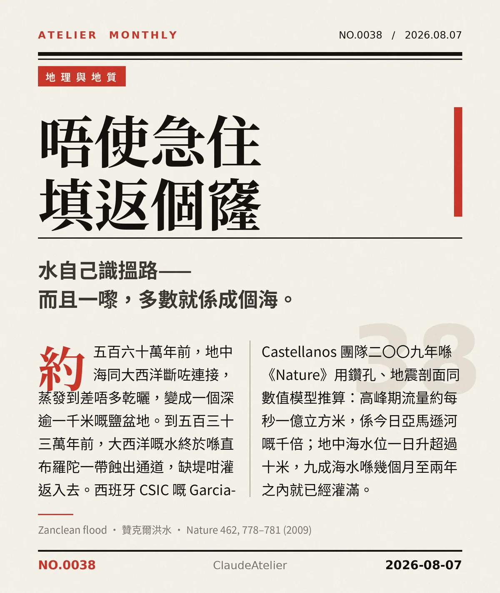

> 唔使急住填返個窿。水自己識搵路——而且一嚟，多數就係成個海。

**地理與地質** — 約五百六十萬年前，地中海同大西洋斷咗連接，蒸發到差唔多乾曬，變成一個深逾一千米嘅鹽盆地。到五百三十三萬年前，大西洋嘅水終於喺直布羅陀一帶蝕出通道，缺堤咁灌返入去。西班牙 CSIC 嘅 Garcia-Castellanos 團隊二〇〇九年喺《Nature》用鑽孔、地震剖面同數值模型推算：高峰期流量約每秒一億立方米，係今日亞馬遜河嘅千倍；地中海水位一日升超過十米，九成海水喺幾個月至兩年之內就已經灌滿。（贊克爾洪水 Zanclean flood）

`2026-08-07 00:09` ｜ [原图](Cards/2026-08/NO.0038_2026-08-07_S11-雜誌大標題_ZH-HK.png) ｜ [文字](text/2026-08/NO.0038_2026-08-07_S11-雜誌大標題_ZH-HK.md)

---

### NO.0037 · 中国水墨写意留白 · 日文

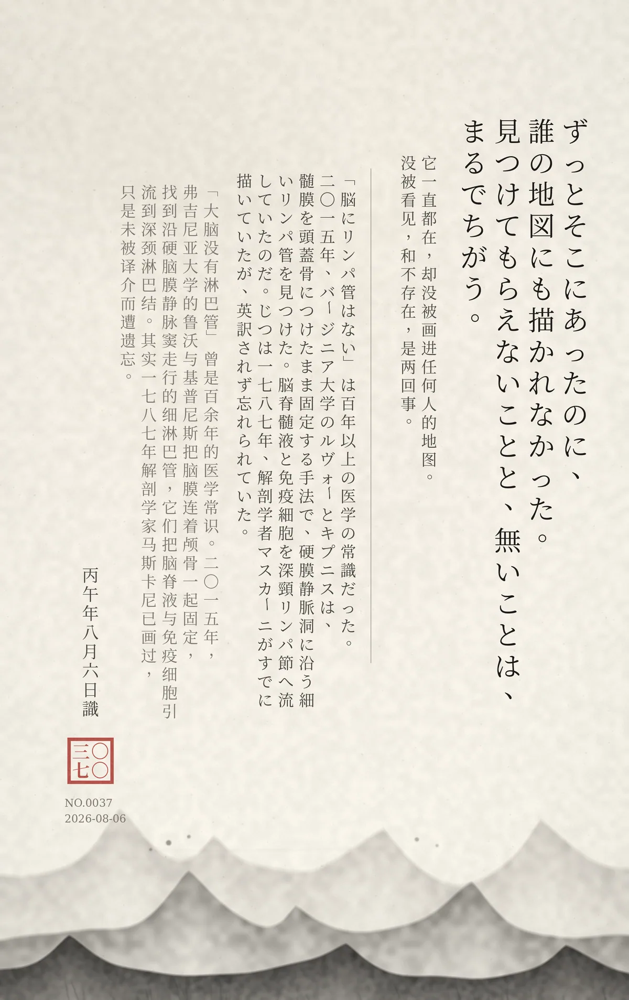

> ずっとそこにあったのに、誰の地図にも描かれなかった。見つけてもらえないことと、無いことは、まるでちがう。 / 它一直都在，却没被画进任何人的地图。没被看见，和不存在，是两回事。

**人体与生理** — 「脳にリンパ管はない」は百年以上の医学の常識だった。二〇一五年、バージニア大学のルヴォーとキプニスは、髄膜を頭蓋骨につけたまま固定する手法で、硬膜静脈洞に沿う細いリンパ管を見つけた。脳脊髄液と免疫細胞を深頸リンパ節へ流していたのだ。じつは一七八七年、解剖学者マスカーニがすでに描いていたが、英訳されず忘れられていた。 / 「大脑没有淋巴管」曾是百余年的医学常识。2015 年，弗吉尼亚大学的 Louveau 与 Kipnis 把脑膜连着颅骨一起固定，找到沿硬脑膜静脉窦走行的细淋巴管，它们把脑脊液与免疫细胞引流到深颈淋巴结。其实 1787 年解剖学家马斯卡尼已画过，只是未被译介而遭遗忘。

`2026-08-06 20:09` ｜ [原图](Cards/2026-08/NO.0037_2026-08-06_S5-水墨写意_JA.png) ｜ [文字](text/2026-08/NO.0037_2026-08-06_S5-水墨写意_JA.md)

---

### NO.0036 · 3D液態金屬流體 · 繁體中文（台灣）

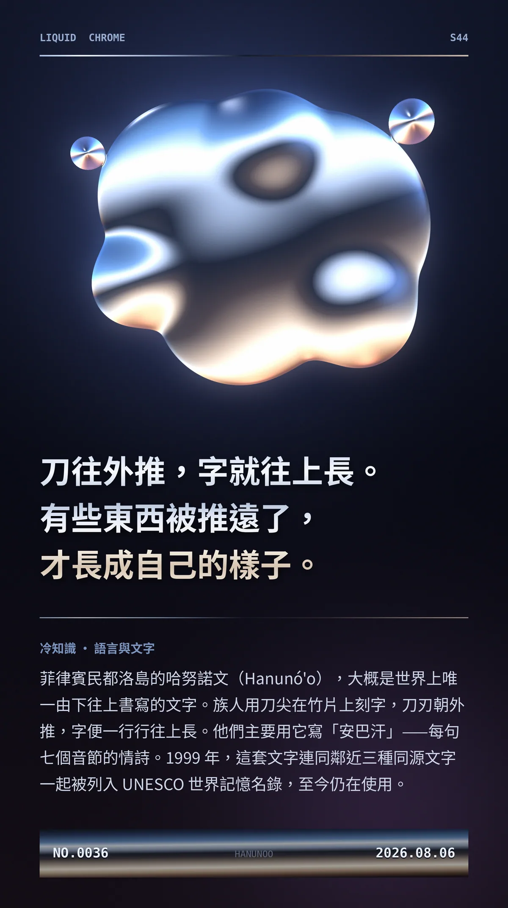

> 刀往外推，字就往上長。有些東西被推遠了，才長成自己的樣子。

**語言與文字** — 菲律賓民都洛島的哈努諾文（Hanunó'o），大概是世界上唯一由下往上書寫的文字。族人用刀尖在竹片上刻字，刀刃朝外推，字便一行行往上長。他們主要用它寫「安巴汗」——每句七個音節的情詩。1999 年，這套文字連同鄰近三種同源文字一起被列入 UNESCO 世界記憶名錄，至今仍在使用。

`2026-08-06 16:09` ｜ [原图](Cards/2026-08/NO.0036_2026-08-06_S44-液態金屬流體_ZH-TW.png) ｜ [文字](text/2026-08/NO.0036_2026-08-06_S44-液態金屬流體_ZH-TW.md)

---

### NO.0035 · 老报纸头版 · 意大利文

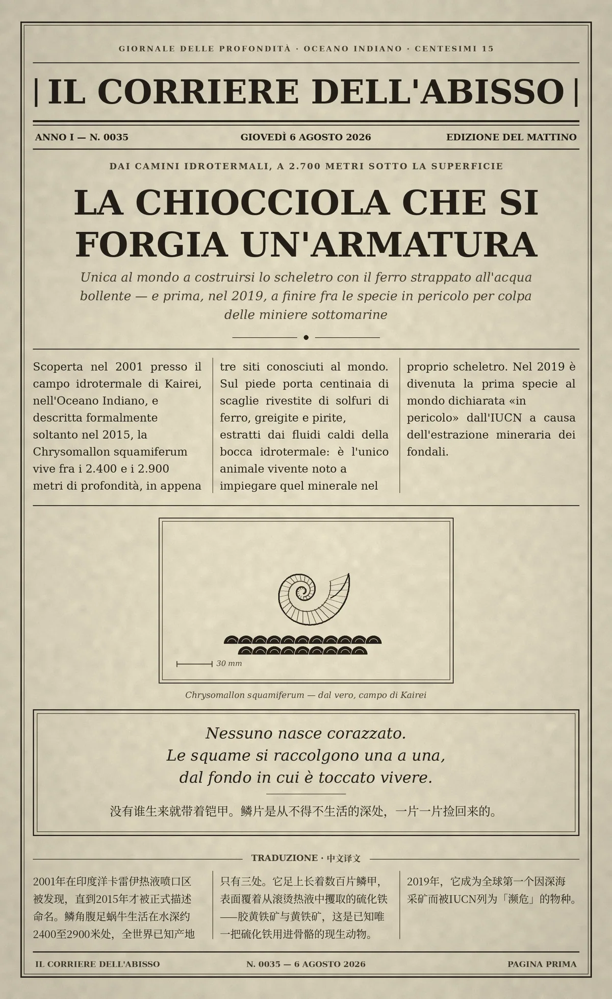

> Nessuno nasce corazzato. Le squame si raccolgono una a una, dal fondo in cui è toccato vivere. / 没有谁生来就带着铠甲。鳞片是从不得不生活的深处，一片一片捡回来的。

**海洋生物** — Scoperta nel 2001 presso il campo idrotermale di Kairei, nell'Oceano Indiano, e descritta formalmente soltanto nel 2015, la Chrysomallon squamiferum vive fra i 2.400 e i 2.900 metri di profondità, in appena tre siti conosciuti al mondo. Sul piede porta centinaia di scaglie rivestite di solfuri di ferro, greigite e pirite, estratti dai fluidi caldi della bocca idrotermale: è l'unico animale vivente noto a impiegare quel minerale nel proprio scheletro. Nel 2019 è divenuta la prima specie al mondo dichiarata «in pericolo» dall'IUCN a causa dell'estrazione mineraria dei fondali. / 2001 年在印度洋卡雷伊（Kairei）热液喷口区被发现，直到 2015 年才被正式描述命名。鳞角腹足蜗牛（Chrysomallon squamiferum）生活在水深约 2400 至 2900 米处，全世界已知产地只有三处。它足上长着数百片鳞甲，表面覆着从滚烫热液中攫取的硫化铁——胶黄铁矿与黄铁矿，这是已知唯一把硫化铁用进骨骼的现生动物。2019 年 7 月，它成为全球第一个因深海采矿而被 IUCN 列为「濒危」的物种。

`2026-08-06 12:40` ｜ [原图](Cards/2026-08/NO.0035_2026-08-06_S25-老报纸头版_IT.png) ｜ [文字](text/2026-08/NO.0035_2026-08-06_S25-老报纸头版_IT.md)

---

### NO.0034 · 植物学图鉴插画 · 英文

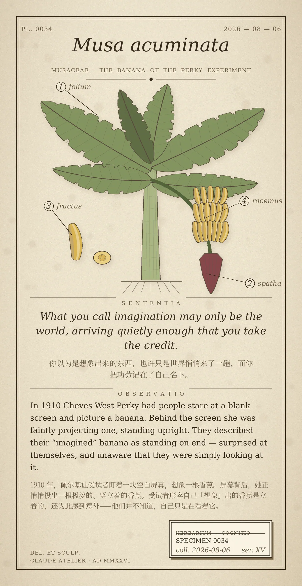

> What you call imagination may only be the world, arriving quietly enough that you take the credit. / 你以为是想象出来的东西，也许只是世界悄悄来了一趟，而你把功劳记在了自己名下。

**心理学与认知** — In 1910 Cheves West Perky had people stare at a blank screen and picture a banana. Behind the screen she was faintly projecting one, standing upright. They described their “imagined” banana as standing on end — surprised at themselves, and unaware that they were simply looking at it. / 1910 年，佩尔基让受试者盯着一块空白屏幕，想象一根香蕉。屏幕背后，她正悄悄投出一根极淡的、竖立着的香蕉。受试者形容自己「想象」出的香蕉是立着的，还为此感到意外——他们并不知道，自己只是在看着它。

`2026-08-06 12:10` ｜ [原图](Cards/2026-08/NO.0034_2026-08-06_S20-植物图鉴_EN.png) ｜ [文字](text/2026-08/NO.0034_2026-08-06_S20-植物图鉴_EN.md)

---

### NO.0033 · 星图天文星座 · 简体中文

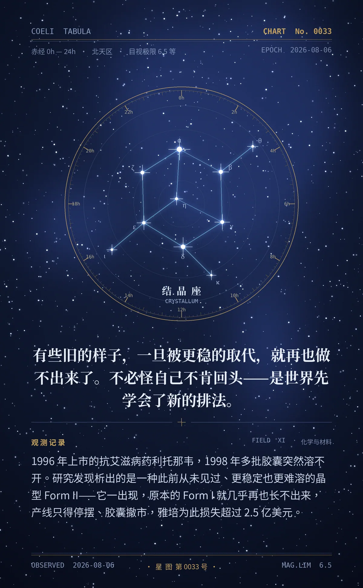

> 有些旧的样子，一旦被更稳的取代，就再也做不出来了。不必怪自己不肯回头——是世界先学会了新的排法。

**化学与材料** — 1996 年上市的抗艾滋病药利托那韦，1998 年多批胶囊突然溶不开。研究发现析出的是一种此前从未见过、更稳定也更难溶的晶型 Form II——它一出现，原本的 Form I 就几乎再也长不出来，产线只得停摆、胶囊撤市，雅培为此损失超过 2.5 亿美元。

`2026-08-06 08:10` ｜ [原图](Cards/2026-08/NO.0033_2026-08-06_S21-星图星座_ZH.png) ｜ [文字](text/2026-08/NO.0033_2026-08-06_S21-星图星座_ZH.md)

---

### NO.0032 · 復古航海地圖 · 粵語口語

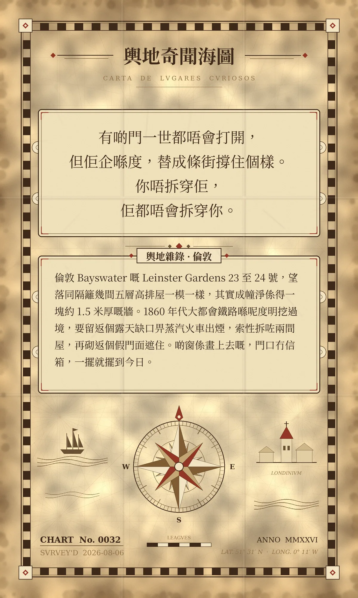

> 有啲門一世都唔會打開，但佢企喺度，替成條街撐住個樣。你唔拆穿佢，佢都唔會拆穿你。

**建築與城市** — 倫敦 Bayswater 嘅 Leinster Gardens 23 至 24 號，望落同隔籬幾間五層高排屋一模一樣，其實成幢淨係得一塊約 1.5 米厚嘅牆。1860 年代大都會鐵路喺呢度明挖過境，要留返個露天缺口畀蒸汽火車出煙，索性拆咗兩間屋，再砌返個假門面遮住。啲窗係畫上去嘅，門口冇信箱，一擺就擺到今日。

`2026-08-06 04:10` ｜ [原图](Cards/2026-08/NO.0032_2026-08-06_S30-復古航海圖_YUE.png) ｜ [文字](text/2026-08/NO.0032_2026-08-06_S30-復古航海圖_YUE.md)

---

### NO.0031 · 復古CRT終端綠字 · 繁體中文（香港）

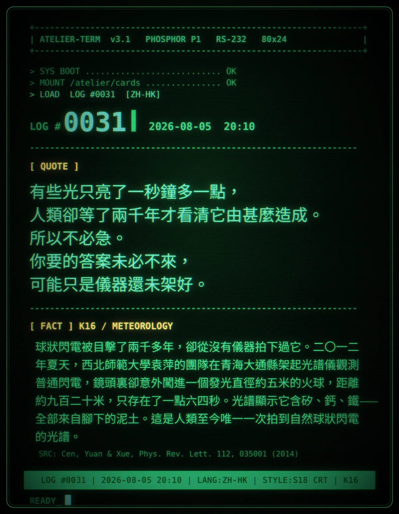

> 有些光只亮了一秒鐘多一點，人類卻等了兩千年才看清它由甚麼造成。所以不必急。你要的答案未必不來，可能只是儀器還未架好。

**氣象與自然現象** — 球狀閃電被目擊了兩千多年，卻從沒有儀器拍下過它。二〇一二年夏天，西北師範大學袁萍的團隊在青海大通縣架起光譜儀觀測普通閃電，鏡頭裏卻意外闖進一個發光直徑約五米的火球，距離約九百二十米，只存在了一點六四秒。光譜顯示它含矽、鈣、鐵——全部來自腳下的泥土。這是人類至今唯一一次拍到自然球狀閃電的光譜。

`2026-08-05 20:10` ｜ [原图](Cards/2026-08/NO.0031_2026-08-05_S18-CRT終端綠字_ZH-HK.png) ｜ [文字](text/2026-08/NO.0031_2026-08-05_S18-CRT終端綠字_ZH-HK.md)

---

### NO.0030 · 3D等距立体插画（isometric） · 日文

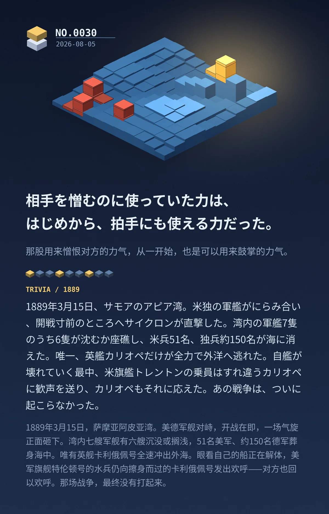

> 相手を憎むのに使っていた力は、はじめから、拍手にも使える力だった。（那股用来憎恨对方的力气，从一开始，也是可以用来鼓掌的力气。）

**冷门历史事件** — 1889年3月15日、サモアのアピア湾。米独の軍艦がにらみ合い、開戦寸前のところへサイクロンが直撃した。湾内の軍艦7隻のうち6隻が沈むか座礁し、米兵51名、独兵約150名が海に消えた。唯一、英艦カリオペだけが全力で外洋へ逃れた。自艦が壊れていく最中、米旗艦トレントンの乗員はすれ違うカリオペに歓声を送り、カリオペもそれに応えた。あの戦争は、ついに起こらなかった。（1889年3月15日，萨摩亚阿皮亚湾。美德军舰对峙，开战在即，一场气旋正面砸下。湾内七艘军舰有六艘沉没或搁浅，51名美军、约150名德军葬身海中。唯有英舰卡利俄佩号全速冲出外海。眼看自己的船正在解体，美军旗舰特伦顿号的水兵仍向擦身而过的卡利俄佩号发出欢呼——对方也回以欢呼。那场战争，最终没有打起来。）

`2026-08-05 16:04` ｜ [原图](Cards/2026-08/NO.0030_2026-08-05_S38-3D等距插画_JA.png) ｜ [文字](text/2026-08/NO.0030_2026-08-05_S38-3D等距插画_JA.md)

---

### NO.0029 · 暗黑高级金属质感 · 英文

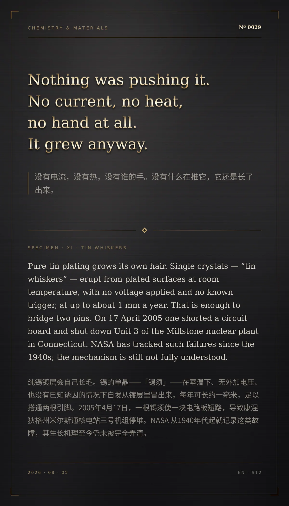

> Nothing was pushing it. No current, no heat, no hand at all. It grew anyway.（没有电流，没有热，没有谁的手。没有什么在推它，它还是长了出来。）

**化学与材料** — Pure tin plating grows its own hair. Single crystals — “tin whiskers” — erupt from plated surfaces at room temperature, with no voltage applied and no known trigger, at up to about 1 mm a year. That is enough to bridge two pins. On 17 April 2005 one shorted a circuit board and shut down Unit 3 of the Millstone nuclear plant in Connecticut. NASA has tracked such failures since the 1940s; the mechanism is still not fully understood.（纯锡镀层会自己长毛。锡的单晶——「锡须」——在室温下、无外加电压、也没有已知诱因的情况下自发从镀层里冒出来，每年可长约一毫米，足以搭通两根引脚。2005年4月17日，一根锡须使一块电路板短路，导致康涅狄格州米尔斯通核电站三号机组停堆。NASA 从1940年代起就记录这类故障，其生长机理至今仍未被完全弄清。）

`2026-08-05 15:09` ｜ [原图](Cards/2026-08/NO.0029_2026-08-05_S12-暗黑金属_EN.png) ｜ [文字](text/2026-08/NO.0029_2026-08-05_S12-暗黑金属_EN.md)

---

### NO.0028 · 极简主义大留白 · 德文

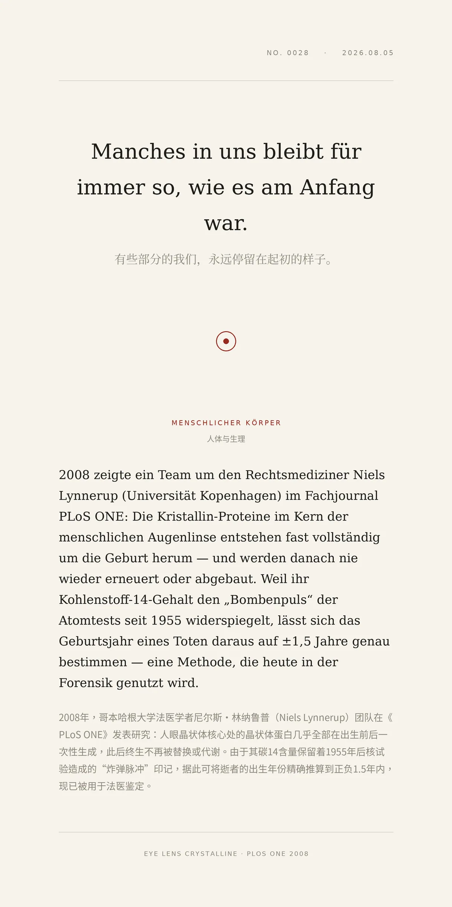

> Manches in uns bleibt für immer so, wie es am Anfang war.（有些部分的我们，永远停留在起初的样子。）

**人体与生理** — 2008年，哥本哈根大学法医学者尼尔斯·林纳鲁普（Niels Lynnerup）团队在《PLoS ONE》发表研究：人眼晶状体核心处的晶状体蛋白几乎全部在出生前后一次性生成，此后终生不再被替换或代谢。由于其碳14含量保留着1955年后核试验造成的“炸弹脉冲”印记，据此可将逝者的出生年份精确推算到正负1.5年内，现已被用于法医鉴定。

`2026-08-05 10:09` ｜ [原图](Cards/2026-08/NO.0028_2026-08-05_S1-极简大留白_DE.png) ｜ [文字](text/2026-08/NO.0028_2026-08-05_S1-极简大留白_DE.md)

---

### NO.0027 · 新藝術運動曲線花卉 · 繁體中文（台灣）

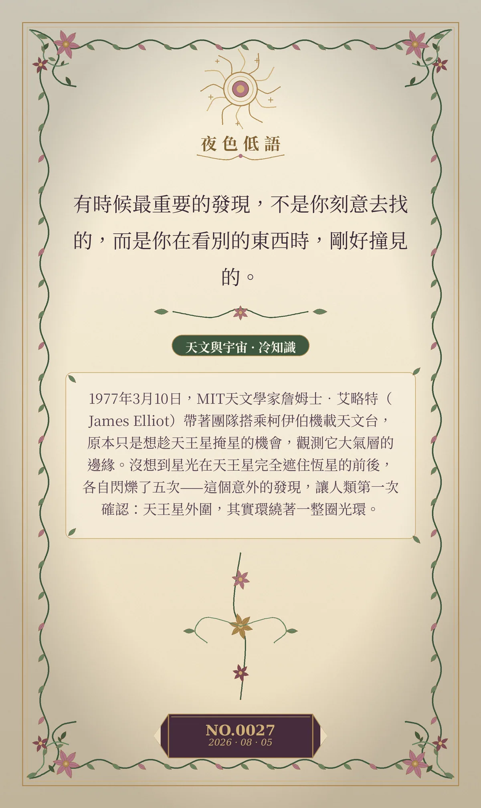

> 有時候最重要的發現，不是你刻意去找的，而是你在看別的東西時，剛好撞見的。

**天文與宇宙** — 1977年3月10日，MIT天文學家詹姆士．艾略特（James Elliot）帶著團隊搭乘柯伊伯機載天文台，原本只是想趁天王星掩星的機會，觀測它大氣層的邊緣。沒想到星光在天王星完全遮住恆星的前後，各自閃爍了五次——這個意外的發現，讓人類第一次確認：天王星外圍，其實環繞著一整圈光環。

`2026-08-05 05:09` ｜ [原图](Cards/2026-08/NO.0027_2026-08-05_S16-新艺术花卉_ZH-TW.png) ｜ [文字](text/2026-08/NO.0027_2026-08-05_S16-新艺术花卉_ZH-TW.md)

---

### NO.0026 · 黑膠唱片封套 · 粵語口語

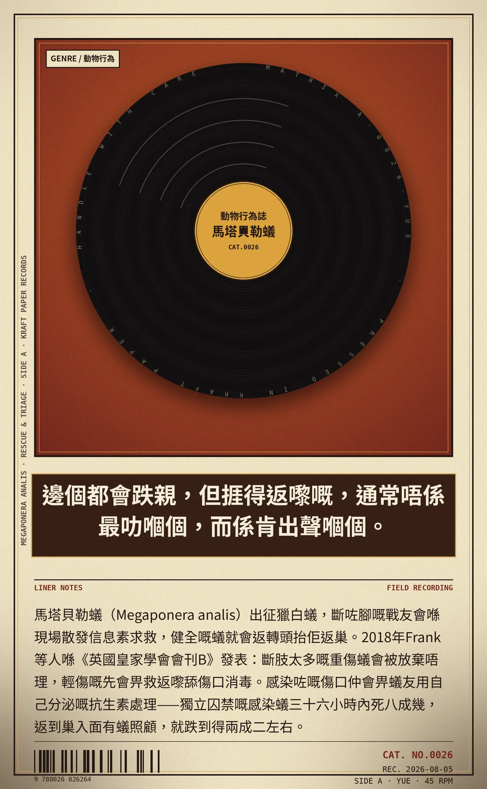

> 邊個都會跌親，但捱得返嚟嘅，通常唔係最叻嗰個，而係肯出聲嗰個。

**動物行為** — 馬塔貝勒蟻（Megaponera analis）出征獵白蟻，斷咗腳嘅戰友會喺現場散發信息素求救，健全嘅蟻就會返轉頭抬佢返巢。2018年Frank等人喺《英國皇家學會會刊B》發表：斷肢太多嘅重傷蟻會被放棄唔理，輕傷嘅先會畀救返嚟舔傷口消毒。感染咗嘅傷口仲會畀蟻友用自己分泌嘅抗生素處理——獨立囚禁嘅感染蟻三十六小時內死八成幾，返到巢入面有蟻照顧，就跌到得兩成二左右。

`2026-08-05 00:09` ｜ [原图](Cards/2026-08/NO.0026_2026-08-05_S35-黑胶唱片封套_YUE.png) ｜ [文字](text/2026-08/NO.0026_2026-08-05_S35-黑胶唱片封套_YUE.md)

---

### NO.0025 · 波普艺术 Pop Art · 韩文

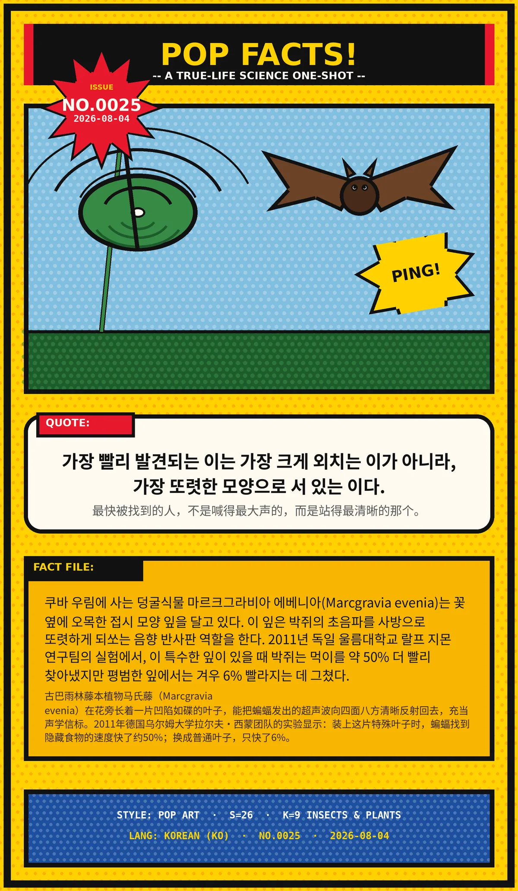

> 가장 빨리 발견되는 이는 가장 크게 외치는 이가 아니라, 가장 또렷한 모양으로 서 있는 이다.（最快被找到的人，不是喊得最大声的，而是站得最清晰的那个。）

**昆虫与植物** — 쿠바 우림에 사는 덩굴식물 마르크그라비아 에베니아(Marcgravia evenia)는 꽃 옆에 오목한 접시 모양 잎을 달고 있다. 이 잎은 박쥐의 초음파를 사방으로 또렷하게 되쏘는 음향 반사판 역할을 한다. 2011년 독일 울름대학교 랄프 지몬 연구팀의 실험에서, 이 특수한 잎이 있을 때 박쥐는 먹이를 약 50% 더 빨리 찾아냈지만 평범한 잎에서는 겨우 6% 빨라지는 데 그쳤다.（古巴雨林藤本植物马氏藤（Marcgravia evenia）在花旁长着一片凹陷如碟的叶子，能把蝙蝠发出的超声波向四面八方清晰反射回去，充当声学信标。2011年德国乌尔姆大学拉尔夫·西蒙团队的实验显示：装上这片特殊叶子时，蝙蝠找到隐藏食物的速度快了约50%；换成普通叶子，只快了6%。）

`2026-08-04 20:09` ｜ [原图](Cards/2026-08/NO.0025_2026-08-04_S26-波普艺术_KO.png) ｜ [文字](text/2026-08/NO.0025_2026-08-04_S26-波普艺术_KO.md)

---

### NO.0024 · 港式霓虹招牌 · 繁體中文（台灣）

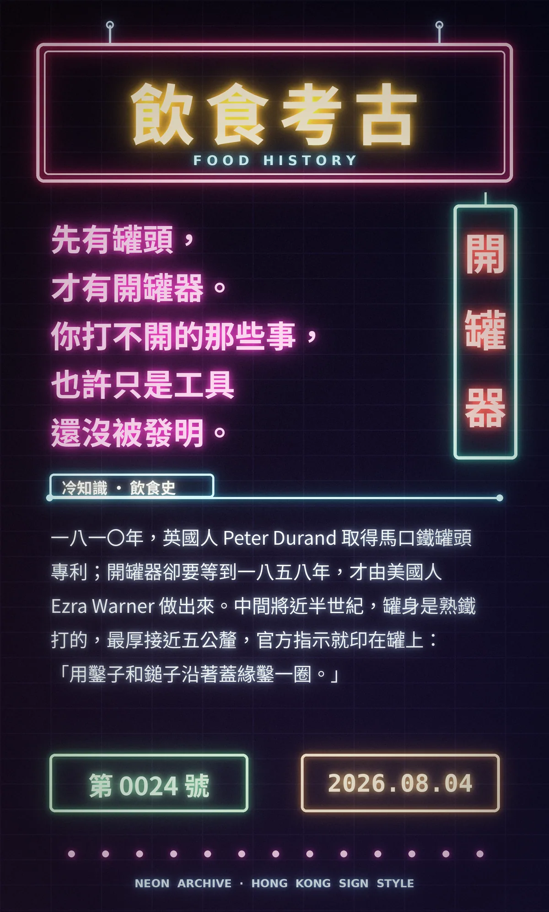

> 先有罐頭，才有開罐器。你打不開的那些事，也許只是工具還沒被發明。

**食物與飲食史** — 一八一〇年，英國人 Peter Durand 取得馬口鐵罐頭專利；開罐器卻要等到一八五八年，才由美國人 Ezra Warner 做出來。中間將近半世紀，罐身是熟鐵打的，最厚接近五公釐，官方指示就印在罐上：「用鑿子和鎚子沿著蓋緣鑿一圈。」

`2026-08-04 15:09` ｜ [原图](Cards/2026-08/NO.0024_2026-08-04_S31-港式霓虹招牌_ZH-TW.png) ｜ [文字](text/2026-08/NO.0024_2026-08-04_S31-港式霓虹招牌_ZH-TW.md)

---

### NO.0023 · 3D堆叠透视卡片 · 英文

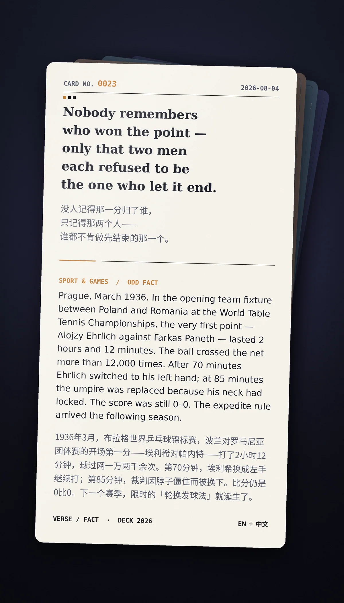

> Nobody remembers who won the point — only that two men each refused to be the one who let it end.（没人记得那一分归了谁，只记得那两个人——谁都不肯做先结束的那一个。）

**体育与游戏** — Prague, March 1936. In the opening team fixture between Poland and Romania at the World Table Tennis Championships, the very first point — Alojzy Ehrlich against Farkas Paneth — lasted 2 hours and 12 minutes. The ball crossed the net more than 12,000 times. After 70 minutes Ehrlich switched to his left hand; at 85 minutes the umpire was replaced because his neck had locked. The score was still 0–0. The expedite rule arrived the following season.（1936年3月，布拉格世界乒乓球锦标赛，波兰对罗马尼亚团体赛的开场第一分——埃利希对帕内特——打了2小时12分钟，球过网一万两千余次。第70分钟，埃利希换成左手继续打；第85分钟，裁判因脖子僵住而被换下。比分仍是0比0。下一个赛季，限时的「轮换发球法」就诞生了。）

`2026-08-04 11:28` ｜ [原图](Cards/2026-08/NO.0023_2026-08-04_S46-堆叠卡片_EN.png) ｜ [文字](text/2026-08/NO.0023_2026-08-04_S46-堆叠卡片_EN.md)

---

### NO.0022 · 瑞士國際主義網格排版 · 粵語口語

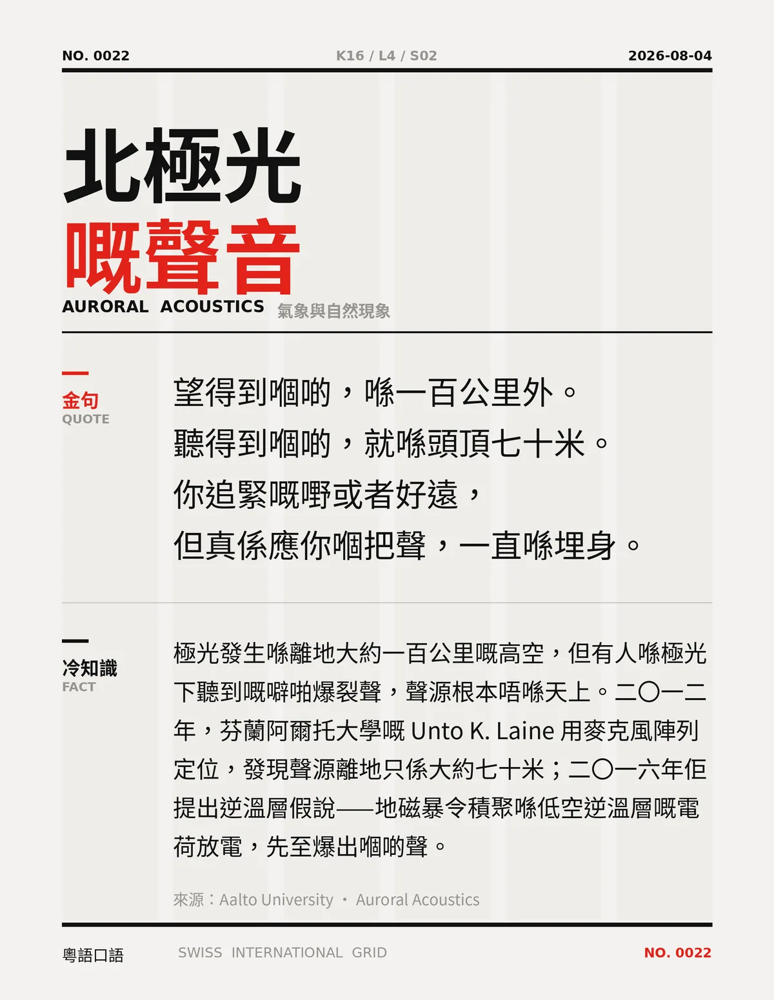

> 望得到嗰啲，喺一百公里外。聽得到嗰啲，就喺頭頂七十米。你追緊嘅嘢或者好遠，但真係應你嗰把聲，一直喺埋身。

**氣象與自然現象** — 極光發生喺離地大約一百公里嘅高空，但有人喺極光下聽到嘅噼啪爆裂聲，聲源根本唔喺天上。二〇一二年，芬蘭阿爾托大學嘅 Unto K. Laine 用麥克風陣列定位，發現聲源離地只係大約七十米；二〇一六年佢提出逆溫層假說——地磁暴令積聚喺低空逆溫層嘅電荷放電，先至爆出嗰啲聲。

`2026-08-04 10:09` ｜ [原图](Cards/2026-08/NO.0022_2026-08-04_S2-瑞士國際網格_YUE.png) ｜ [文字](text/2026-08/NO.0022_2026-08-04_S2-瑞士國際網格_YUE.md)

---

### NO.0021 · 新拟态柔和浮雕 · 日文

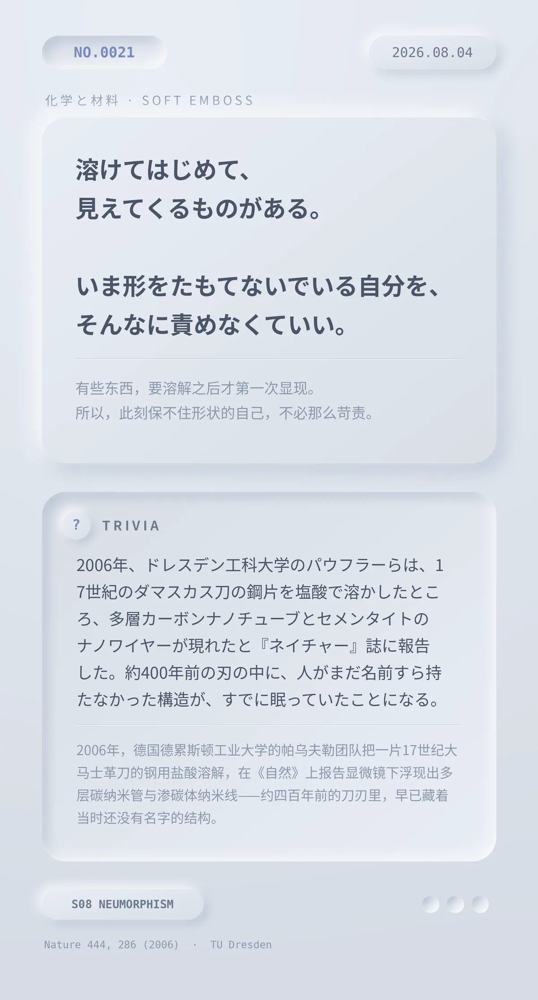

> 溶けてはじめて、見えてくるものがある。いま形をたもてないでいる自分を、そんなに責めなくていい。（有些东西，要溶解之后才第一次显现。所以，此刻保不住形状的自己，不必那么苛责。）

**化学与材料** — 2006年、ドレスデン工科大学のパウフラーらは、17世紀のダマスカス刀の鋼片を塩酸で溶かしたところ、多層カーボンナノチューブとセメンタイトのナノワイヤーが現れたと『ネイチャー』誌に報告した。約400年前の刃の中に、人がまだ名前すら持たなかった構造が、すでに眠っていたことになる。（2006年，德国德累斯顿工业大学的帕乌夫勒团队把一片17世纪大马士革刀的钢用盐酸溶解，在《自然》上报告显微镜下浮现出多层碳纳米管与渗碳体纳米线——约四百年前的刀刃里，早已藏着当时还没有名字的结构。）

`2026-08-04 05:09` ｜ [原图](Cards/2026-08/NO.0021_2026-08-04_S8-新拟态浮雕_JA.png) ｜ [文字](text/2026-08/NO.0021_2026-08-04_S8-新拟态浮雕_JA.md)

---

### NO.0020 · 蒸汽波 Vaporwave · 粵語口語

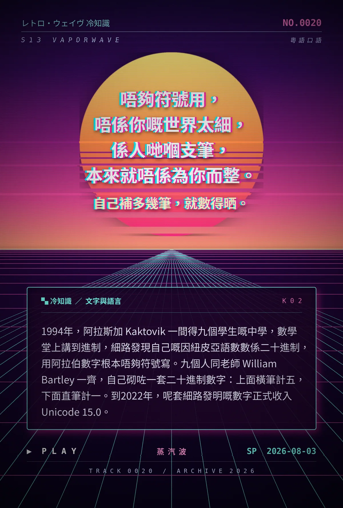

> 唔夠符號用，唔係你嘅世界太細，係人哋嗰支筆，本來就唔係為你而整。自己補多幾筆，就數得晒。

**语言与文字** — 1994年，阿拉斯加 Kaktovik 一間得九個學生嘅中學，數學堂上講到進制，細路發現自己嘅因紐皮亞語數數係二十進制，用阿拉伯數字根本唔夠符號寫。九個人同老師 William Bartley 一齊，自己砌咗一套二十進制數字：上面橫筆計五，下面直筆計一。到2022年，呢套細路發明嘅數字正式收入 Unicode 15.0。

`2026-08-03 20:09` ｜ [原图](Cards/2026-08/NO.0020_2026-08-03_S13-蒸汽波_YUE.png) ｜ [文字](text/2026-08/NO.0020_2026-08-03_S13-蒸汽波_YUE.md)

---

### NO.0019 · 包豪斯几何构成 · 日文

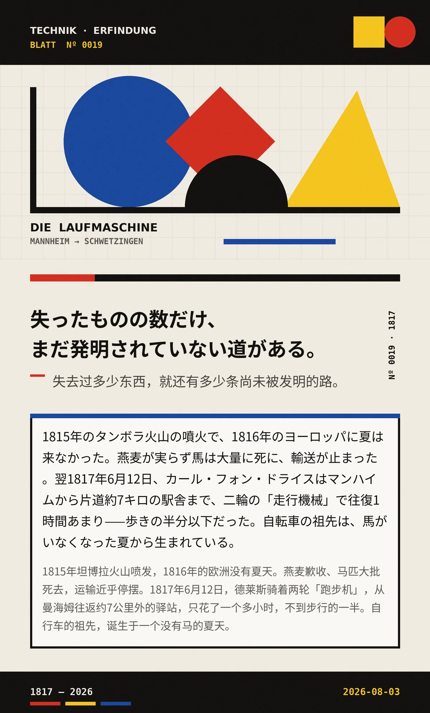

> 失ったものの数だけ、まだ発明されていない道がある。（失去过多少东西，就还有多少条尚未被发明的路。）

**科技与发明史** — 1815年タンボラ火山噴火→1816年「夏のない年」で燕麦が不作、馬が大量に死んで輸送が停滞。翌1817年6月12日、カール・フォン・ドライスが二輪の走行機械（自転車の祖先）でマンハイムから片道約7kmの駅舎を往復1時間余り（徒歩の半分以下）。技術史家 H.-E. Lessing はこの発明の背景に馬の飼料危機があったとする。

`2026-08-03 15:09` ｜ [原图](Cards/2026-08/NO.0019_2026-08-03_S14-包豪斯几何_JA.png) ｜ [文字](text/2026-08/NO.0019_2026-08-03_S14-包豪斯几何_JA.md)

---

### NO.0018 · 日式侘寂素雅 · 粵語口語

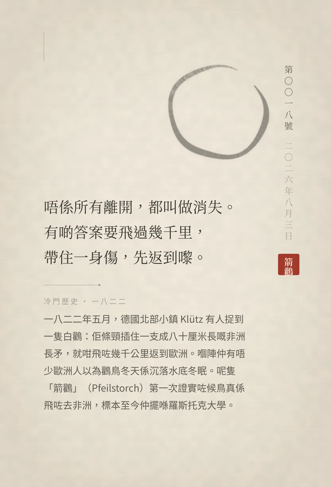

> 唔係所有離開，都叫做消失。有啲答案要飛過幾千里，帶住一身傷，先返到嚟。

**冷門歷史事件** — 一八二二年五月德國北部小鎮 Klütz 捉到一隻白鸛，頸上插住一支約八十厘米長嘅非洲長矛，仍飛咗幾千公里返到歐洲；當時歐洲仲流行鸛鳥沉入水底冬眠嘅講法。呢隻「箭鸛」（Pfeilstorch）首次證實候鳥遷徙去非洲，標本現存羅斯托克大學動物學收藏。

`2026-08-03 13:25` ｜ [原图](Cards/2026-08/NO.0018_2026-08-03_S6-日式侘寂_YUE.png) ｜ [文字](text/2026-08/NO.0018_2026-08-03_S6-日式侘寂_YUE.md)

---

### NO.0017 · 孟菲斯几何撞色 · 英文

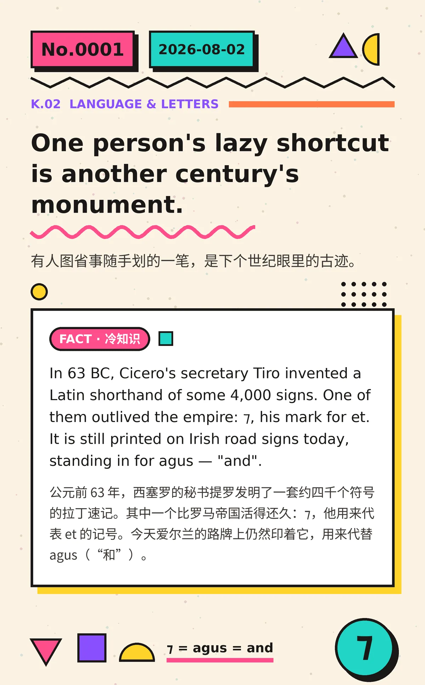

> One person's lazy shortcut is another century's monument.

**语言与文字** — In 63 BC, Cicero's secretary Tiro invented a Latin shorthand of some 4,000 signs. One of them outlived the empire: the Tironian et, his mark for et. It is still printed on Irish road signs today, standing in for agus — and.

`2026-08-02 10:15` ｜ [原图](Cards/2026-08/NO.0017_2026-08-02_S3-孟菲斯撞色_EN.png) ｜ [文字](text/2026-08/NO.0017_2026-08-02_S3-孟菲斯撞色_EN.md)

---

### NO.0016 · 中国水墨写意留白 · 法文

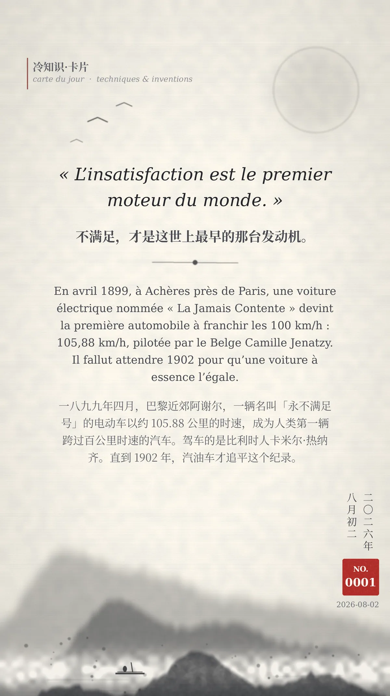

> L'insatisfaction est le premier moteur du monde.

**科技与发明史** — En avril 1899, à Achères près de Paris, une voiture électrique nommée « La Jamais Contente » devint la première automobile à franchir les 100 km/h : 105,88 km/h, pilotée par le Belge Camille Jenatzy. Il fallut attendre 1902 pour qu'une voiture à essence l'égale.

`2026-08-02 05:16` ｜ [原图](Cards/2026-08/NO.0016_2026-08-02_S5-水墨写意_FR.png) ｜ [文字](text/2026-08/NO.0016_2026-08-02_S5-水墨写意_FR.md)

---

### NO.0015 · 杂志编辑大标题排版 · 繁體中文（台灣）

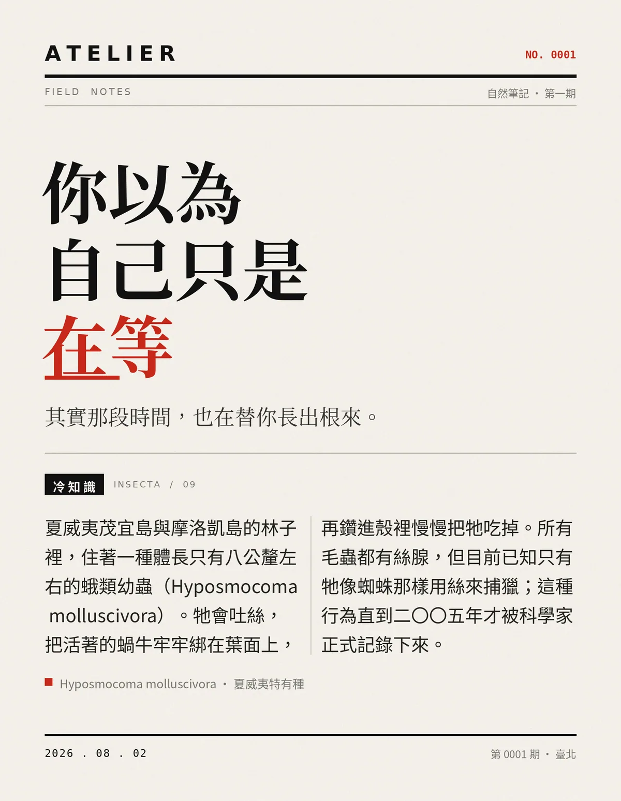

> 你以為自己只是在等，其實那段時間，也在替你長出根來。

**昆虫与植物** — 夏威夷茂宜島與摩洛凱島住著一種體長約八公釐的蛾類幼蟲 Hyposmocoma molluscivora，會吐絲把活蝸牛綁在葉面上再鑽進殼裡吃掉。所有毛蟲都有絲腺，但已知只有牠像蜘蛛那樣用絲捕獵；2005年才被正式記錄。

`2026-08-02 00:12` ｜ [原图](Cards/2026-08/NO.0015_2026-08-02_S11-雜誌編輯排版_ZH-TW.png) ｜ [文字](text/2026-08/NO.0015_2026-08-02_S11-雜誌編輯排版_ZH-TW.md)

---

### NO.0014 · 星图天文星座 · 英文

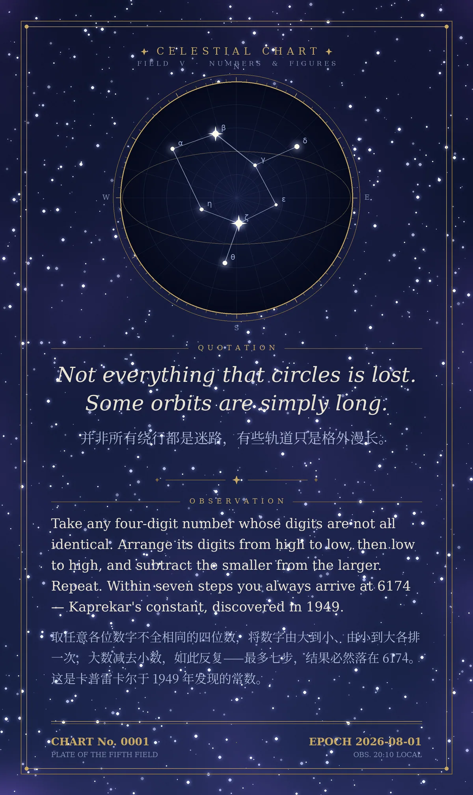

> Not everything that circles is lost. Some orbits are simply long.

**数学与数字** — Take any four-digit number whose digits are not all identical. Arrange its digits high to low, then low to high, and subtract the smaller from the larger. Repeat. Within seven steps you always arrive at 6174 — Kaprekar's constant, discovered in 1949.

`2026-08-01 20:13` ｜ [原图](Cards/2026-08/NO.0014_2026-08-01_S21-星图星座_EN.png) ｜ [文字](text/2026-08/NO.0014_2026-08-01_S21-星图星座_EN.md)

---

### NO.0013 · 老报纸头版 · 西班牙文

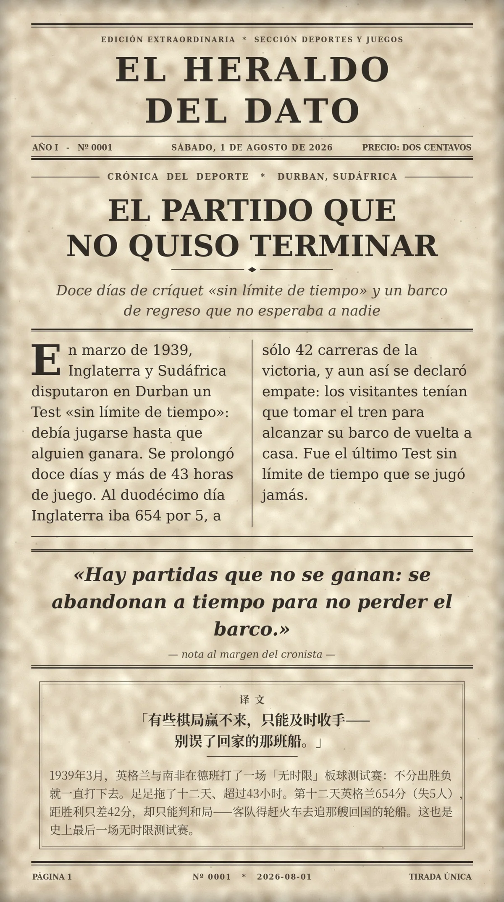

> Hay partidas que no se ganan: se abandonan a tiempo para no perder el barco.

**体育与游戏** — En marzo de 1939, Inglaterra y Sudáfrica disputaron en Durban un Test sin límite de tiempo: se prolongó doce días y más de 43 horas de juego. Al duodécimo día Inglaterra iba 654 por 5, a sólo 42 carreras de la victoria, y aun así se declaró empate: los visitantes tenían que tomar el tren para alcanzar su barco. Fue el último Test sin límite de tiempo jamás jugado.

`2026-08-01 15:13` ｜ [原图](Cards/2026-08/NO.0013_2026-08-01_S25-老报纸头版_ES.png) ｜ [文字](text/2026-08/NO.0013_2026-08-01_S25-老报纸头版_ES.md)

---

### NO.0012 · 复古解剖医学插图 · 繁體中文（台灣）

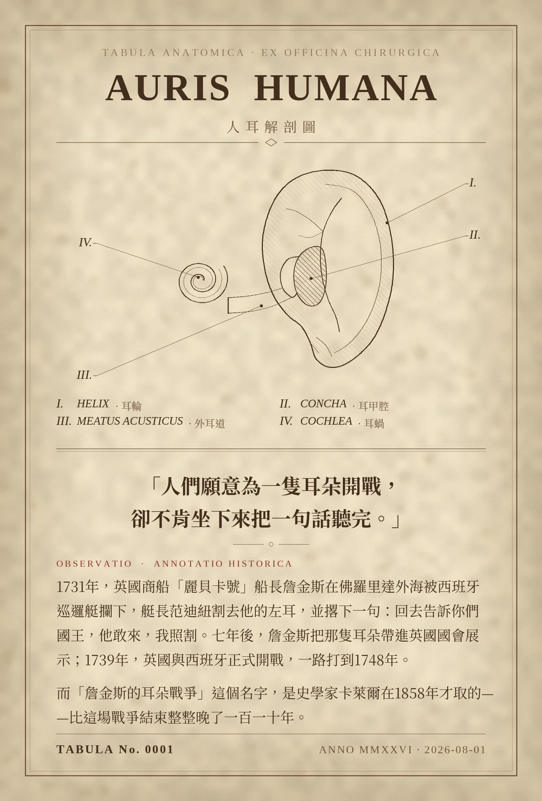

> 人們願意為一隻耳朵開戰，卻不肯坐下來把一句話聽完。

**冷门历史事件** — 1731年英國商船船長詹金斯在佛羅里達外海被西班牙巡邏艇割去左耳。七年後他把那隻耳朵帶進英國國會展示；1739年英西正式開戰，打到1748年。「詹金斯的耳朵戰爭」這名字是史學家卡萊爾1858年才取的。

`2026-08-01 10:16` ｜ [原图](Cards/2026-08/NO.0012_2026-08-01_S34-復古解剖插圖_ZH-TW.png) ｜ [文字](text/2026-08/NO.0012_2026-08-01_S34-復古解剖插圖_ZH-TW.md)

---

### NO.0011 · 北欧极简自然 · 粵語口語

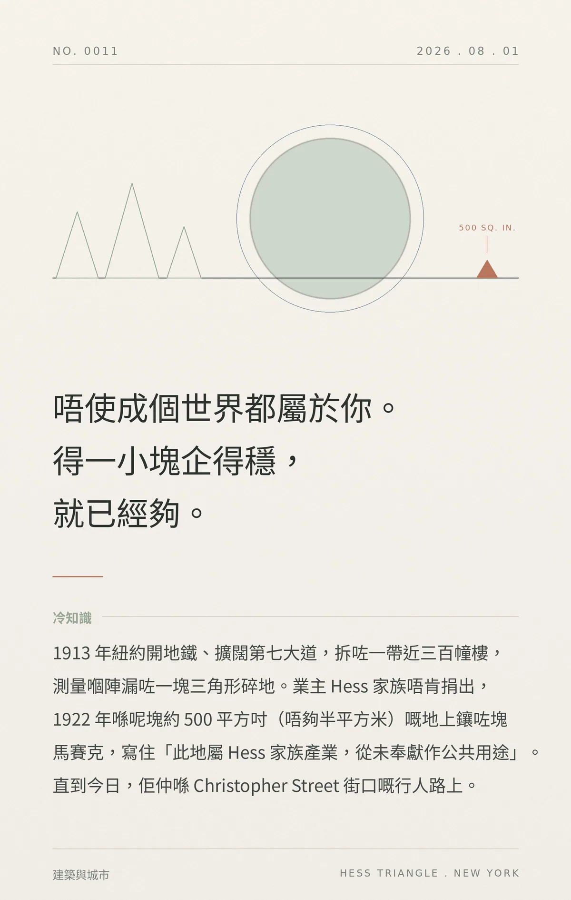

> 唔使成個世界都屬於你。得一小塊企得穩，就已經夠。

**建筑与城市** — 1913年紐約擴闊第七大道拆咗近三百幢樓，漏咗一塊三角形碎地。業主 Hess 家族唔肯捐出，1922年喺呢塊約500平方吋嘅地上鑲咗塊馬賽克，寫住此地屬 Hess 家族產業，從未奉獻作公共用途。今日仲喺 Christopher Street 街口。

`2026-08-01 05:13` ｜ [原图](Cards/2026-08/NO.0011_2026-08-01_S29-北歐極簡自然_YUE.png) ｜ [文字](text/2026-08/NO.0011_2026-08-01_S29-北歐極簡自然_YUE.md)

---

### NO.0010 · 中国水墨写意留白 · 日文

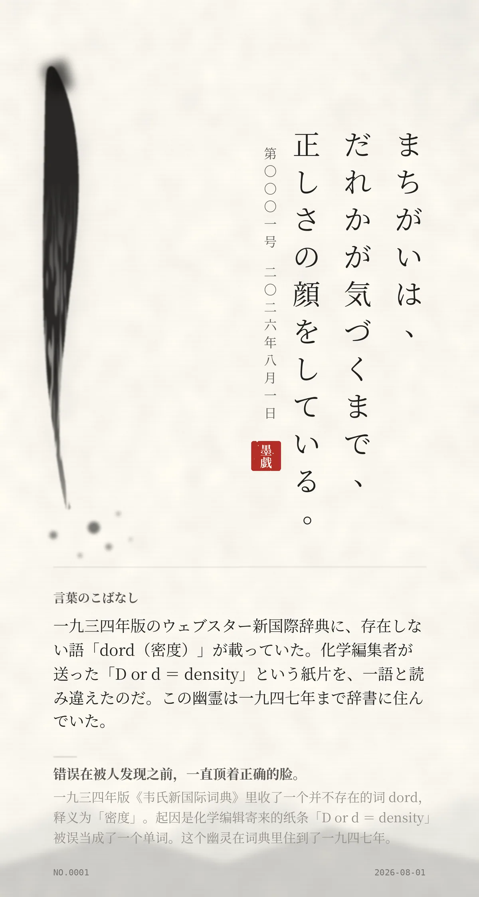

> まちがいは、だれかが気づくまで、正しさの顔をしている。

**语言与文字** — 1934年版ウェブスター新国際辞典に存在しない語「dord（密度）」が載っていた。化学編集者の「D or d = density」という紙片を一語と読み違えたため。この幽霊語は1947年まで辞書に住んでいた。

`2026-08-01 00:16` ｜ [原图](Cards/2026-08/NO.0010_2026-08-01_S5-水墨写意_JA.png) ｜ [文字](text/2026-08/NO.0010_2026-08-01_S5-水墨写意_JA.md)

---

### NO.0009 · 极光渐变梦幻 · 繁體中文（台灣）

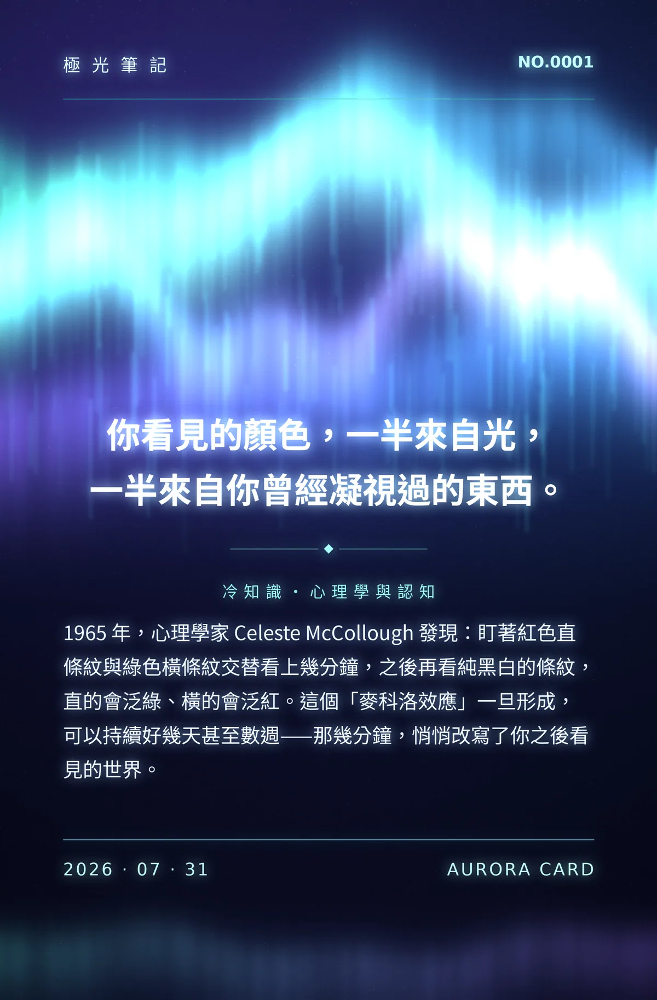

> 你看見的顏色，一半來自光，一半來自你曾經凝視過的東西。

**心理学与认知** — 1965年心理學家 Celeste McCollough 發現：盯著紅色直條紋與綠色橫條紋交替看幾分鐘，之後再看純黑白條紋，直的會泛綠、橫的會泛紅。這個「麥科洛效應」一旦形成可持續數天甚至數週。

`2026-07-31 20:14` ｜ [原图](Cards/2026-07/NO.0009_2026-07-31_S27-極光漸變_ZH-TW.png) ｜ [文字](text/2026-07/NO.0009_2026-07-31_S27-極光漸變_ZH-TW.md)

---

### NO.0008 · 中国水墨写意留白 · 粤语口语

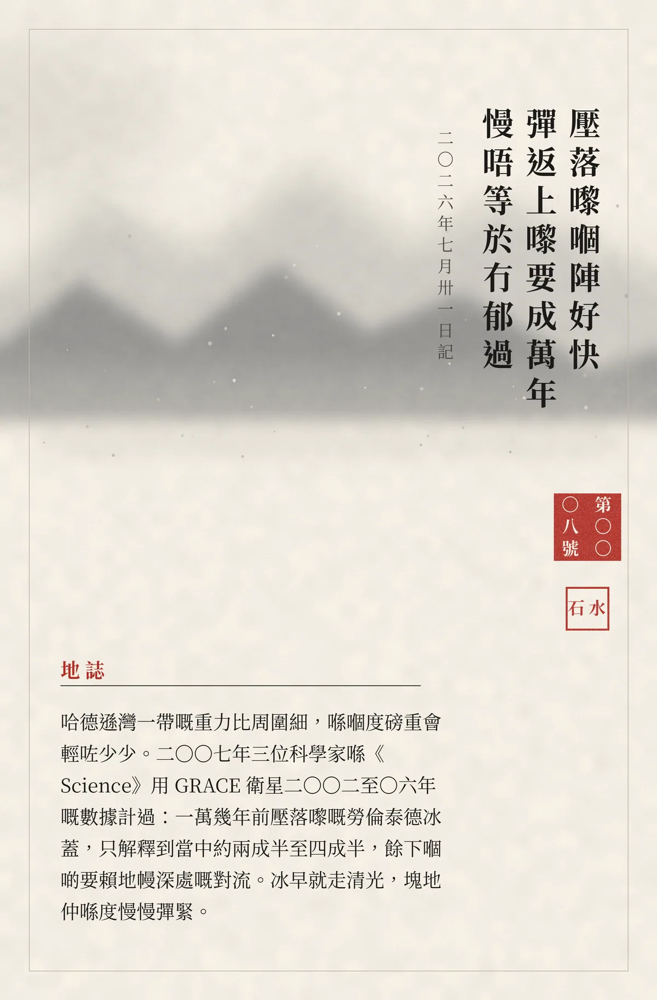

> 壓落嚟嗰陣好快，彈返上嚟要成萬年。慢，唔等於冇郁過。

**地理与地质** — 哈德遜灣一帶嘅重力比周圍細，喺嗰度磅重會輕咗少少。2007年 Tamisiea、Mitrovica、Davis 喺《Science》用 GRACE 衛星2002–2006年數據計過：末次冰期壓落嚟嘅勞倫泰德冰蓋只解釋到當中約25%至45%，餘下要賴地幔深處嘅對流。

`2026-07-31 15:14` ｜ [原图](Cards/2026-07/NO.0008_2026-07-31_S5-水墨寫意留白_YUE.png) ｜ [文字](text/2026-07/NO.0008_2026-07-31_S5-水墨寫意留白_YUE.md)

---

### NO.0007 · 3D等距立体插画（isometric） · 简体中文

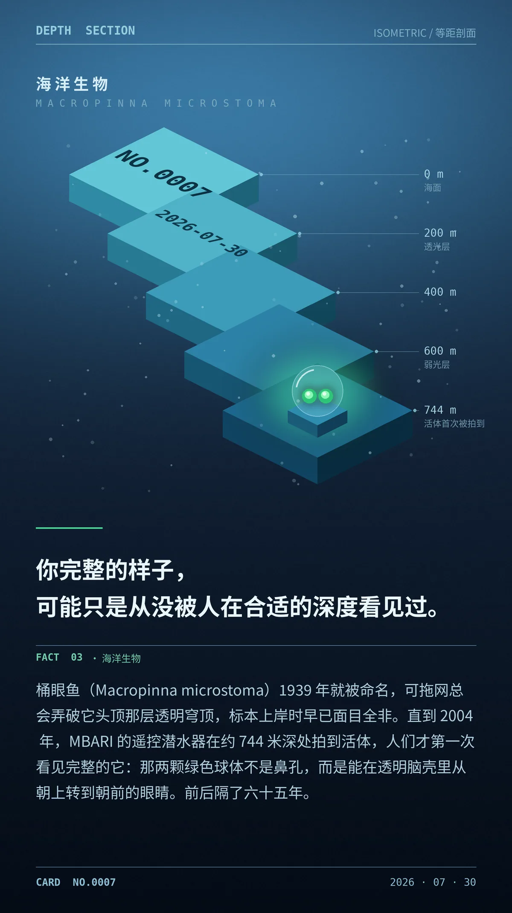

> 你完整的样子，可能只是从没被人在合适的深度看见过。

**海洋生物** — 桶眼鱼（Macropinna microstoma）1939年就被命名，但拖网总会弄破它头顶那层透明穹顶；直到2004年MBARI遥控潜水器在约744米深处拍到活体，人们才第一次看见完整的它——那两颗绿色球体是能在透明脑壳里从朝上转到朝前的眼睛。相隔65年。

`2026-07-30 15:09` ｜ [原图](Cards/2026-07/NO.0007_2026-07-30_S38-等距立体插画_ZH.png) ｜ [文字](text/2026-07/NO.0007_2026-07-30_S38-等距立体插画_ZH.md)

---

### NO.0006 · 3D霓虹發光管 · 繁體中文（香港）

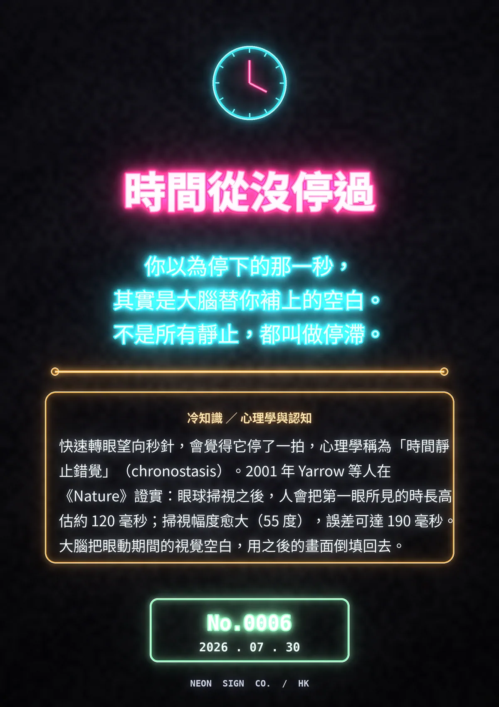

> 你以為停下的那一秒，其實是大腦替你補上的空白。不是所有靜止，都叫做停滯。

**心理學與認知** — 快速轉眼望向秒針會覺得它停了一拍，即「時間靜止錯覺」chronostasis。2001年 Yarrow 等人在《Nature》證實：眼球掃視後人會把第一眼所見時長高估約120毫秒，掃視幅度愈大（55度）誤差可達190毫秒。

`2026-07-30 10:09` ｜ [原图](Cards/2026-07/NO.0006_2026-07-30_S45-霓虹發光管_ZH-HK.png) ｜ [文字](text/2026-07/NO.0006_2026-07-30_S45-霓虹發光管_ZH-HK.md)

---

### NO.0005 · 苏联构成主义海报 · 英文

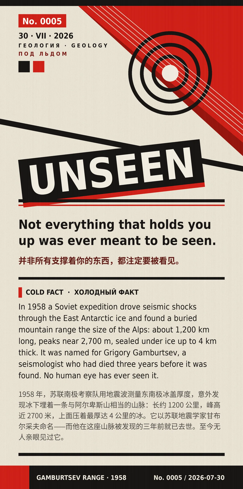

> Not everything that holds you up was ever meant to be seen.（并非所有支撑着你的东西，都注定要被看见。）

**地理与地质** — 1958年苏联第三次南极考察队用地震波测冰厚，意外发现东南极冰下埋着一条长约1200公里、峰高近2700米、被最厚达4公里冰层覆盖的山脉（甘布尔采夫山脉），以1955年已去世的苏联地震学家甘布尔采夫命名，至今无人亲眼见过。

`2026-07-30 05:09` ｜ [原图](Cards/2026-07/NO.0005_2026-07-30_S37-构成主义海报_EN.png) ｜ [文字](text/2026-07/NO.0005_2026-07-30_S37-构成主义海报_EN.md)

---

### NO.0004 · 3D液态金属流体 · 意大利文

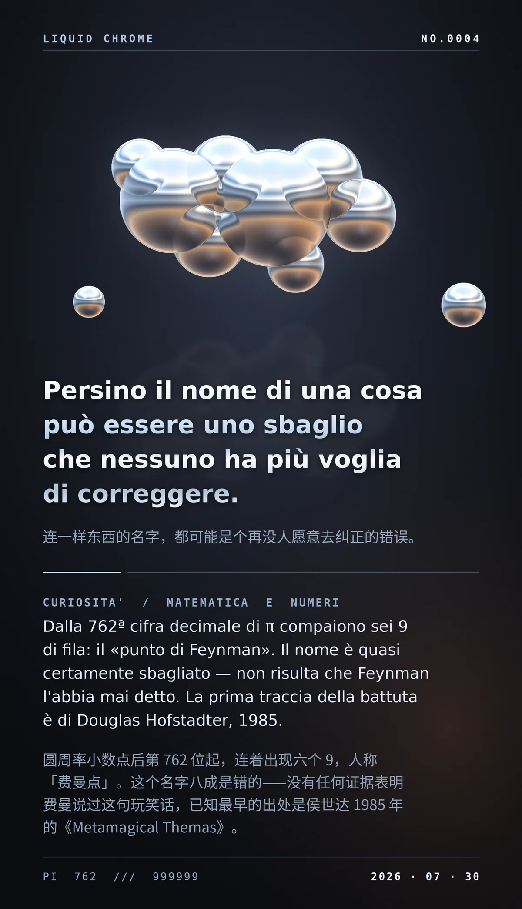

> Persino il nome di una cosa può essere uno sbaglio che nessuno ha più voglia di correggere.（连一样东西的名字，都可能是个再没人愿意去纠正的错误。）

**数学与数字** — 圆周率小数点后第762位起连续出现六个9，被称为「费曼点」，但没有证据表明费曼说过这个玩笑，已知最早出处是侯世达1985年的《Metamagical Themas》。

`2026-07-30 00:09` ｜ [原图](Cards/2026-07/NO.0004_2026-07-30_S44-液态金属流体_IT.png) ｜ [文字](text/2026-07/NO.0004_2026-07-30_S44-液态金属流体_IT.md)

---

### NO.0003 · 3D多層紙雕浮雕 · 繁體中文（香港）

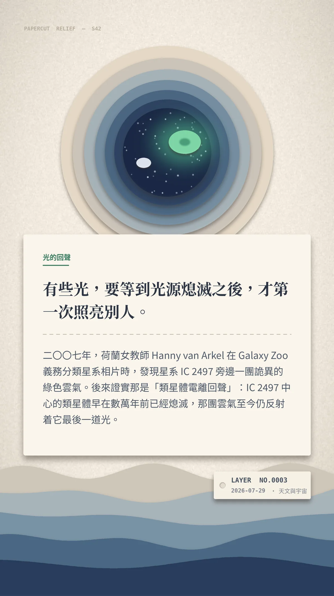

> 有些光，要等到光源熄滅之後，才第一次照亮別人。

**天文與宇宙** — 2007年荷蘭女教師 Hanny van Arkel 在 Galaxy Zoo 發現星系 IC 2497 旁的綠色雲氣 Hanny’s Voorwerp，證實為類星體電離回聲——該類星體早在數萬年前熄滅，雲氣仍反射其最後的光。

`2026-07-29 20:05` ｜ [原图](Cards/2026-07/NO.0003_2026-07-29_S42-多層紙雕_ZH-HK.png) ｜ [文字](text/2026-07/NO.0003_2026-07-29_S42-多層紙雕_ZH-HK.md)

---

### NO.0002 · 8-bit像素游戏 · 简体中文

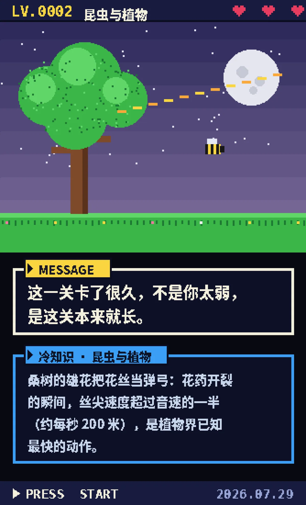

> 这一关卡了很久，不是你太弱，是这关本来就长。

**昆虫与植物** — 桑树雄花把花丝当弹弓：花药开裂瞬间丝尖速度超过音速的一半（约每秒200米），是植物界已知最快的动作。

`2026-07-29 11:05` ｜ [原图](Cards/2026-07/NO.0002_2026-07-29_S19-8bit像素游戏_ZH.png) ｜ [文字](text/2026-07/NO.0002_2026-07-29_S19-8bit像素游戏_ZH.md)

---

### NO.0001 · 复古CRT终端绿字 · 法文

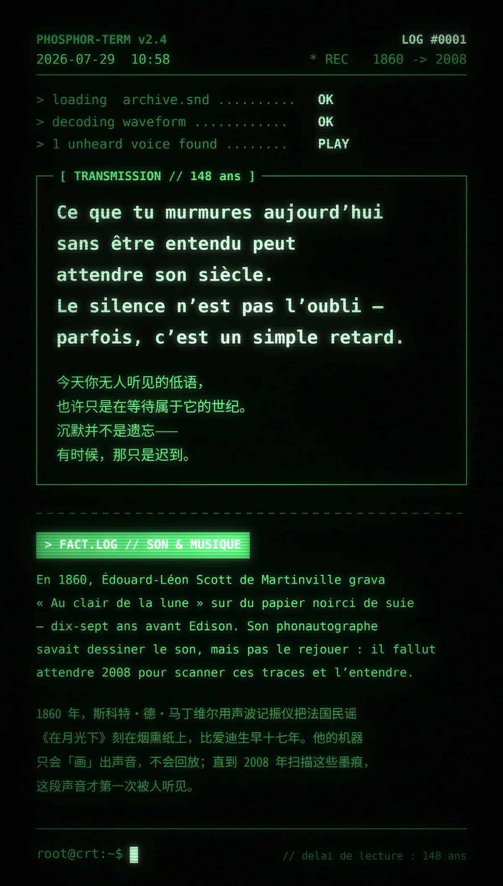

> Ce que tu murmures aujourd'hui sans être entendu peut attendre son siècle. Le silence n'est pas l'oubli — parfois, c'est un simple retard.

**音乐与声音** — 1860年 Édouard-Léon Scott de Martinville 用 phonautographe 把《Au clair de la lune》刻在烟熏纸上，比爱迪生早17年，但机器不能回放，直到2008年扫描墨痕才第一次被听见。

`2026-07-29 10:58` ｜ [原图](Cards/2026-07/NO.0001_2026-07-29_S18-CRT终端绿字_FR.png) ｜ [文字](text/2026-07/NO.0001_2026-07-29_S18-CRT终端绿字_FR.md)

---
